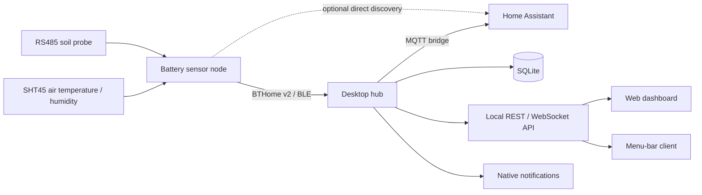
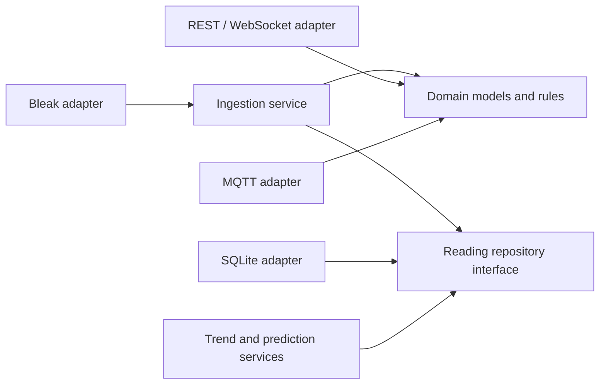

# System architecture

## Context

The sensor owns physical sampling, Modbus decoding, and SHT45 I2C communication.
The hub receives already decoded BTHome measurements; it does not parse Modbus
frames or SHT45 commands. This keeps the radio contract independent of specific
sensor models.

## Product boundaries

| Boundary | Owns | Must not own |
| --- | --- | --- |
| `sensor/` | Probe power, UART/Modbus, SHT45/I2C, measurement scaling, BLE advertising, sleep | History, predictions, user accounts, network integrations |
| `hub/` | BLE collection, identity mapping, persistence, analytics, APIs, notifications | Probe wiring or register-map assumptions |
| `protocol/` | Radio field meanings, units, ordering, fixtures, compatibility policy | Platform-specific transport or storage code |
| `deploy/` | Service definitions, permissions, installation and upgrades | Domain logic |

## Sensor lifecycle

The node wakes on an RTC timer, samples the SHT45, powers the probe, waits for
stabilization, reads and validates Modbus registers, removes probe power,
broadcasts one BTHome sample, and returns to deep sleep. A failed read must still
remove probe power and sleep; it must never advertise stale data. Partial-sample
policy must be defined before implementation so a failed sensor is not silently
reported using an old value.

See [sensor power management](power-management.md) for the RTC wake mechanism,
component power states, failure-safe cleanup, and current-budget model.

## Hub architecture

The hub follows dependency direction toward a platform-independent domain:

- **Domain:** telemetry, plants, thresholds, derived metrics, prediction results.
- **Application:** ingestion, deduplication, retention, alert and analysis flows.
- **Adapters:** Bleak/CoreBluetooth/BlueZ, SQLite, MQTT, HTTP, OS notifications.
- **Clients:** web dashboard and menu-bar UI consume the local API.

SQLite is the first durable store. DuckDB may be used for offline analysis later,
but it should not become a second operational source of truth. InfluxDB remains
an optional export rather than a required service.

## Shared data contract

Contract version 1 is defined in [`protocol/`](../protocol/README.md). Internal
sensor integers avoid floating-point ambiguity; the hub converts encoded values
into domain units after validating device info, object IDs, ordering, and length.

Each stored reading will need at least:

- A hub-assigned stable sensor ID.
- Host receipt time in UTC.
- Soil temperature, soil moisture, conductivity, air temperature, and air
    relative humidity in canonical units.
- Source contract version and raw service data for diagnostics.
- A deduplication key when packet IDs are introduced.

BLE MAC addresses are not a portable identity: CoreBluetooth does not expose the
same address model as BlueZ, and addresses may be private. Stable identity must be
designed explicitly before persistence is implemented, likely through a BTHome
device ID or a hub-side enrollment mapping.

## Failure and trust boundaries

- Reject malformed or unsupported advertisements without writing partial rows.
- Bind local APIs to loopback by default and require explicit LAN exposure.
- Do not log BLE encryption keys, MQTT credentials, or Home Assistant tokens.
- Keep ingestion available when an optional API, MQTT broker, or weather source
    is unavailable.
- Predictions are advisory; actuator control requires a separate safety design
    with maximum runtime, independent shutoff, and manual override.

## References

- [BTHome v2 format](https://bthome.io/format/)
- [Bleak documentation](https://bleak.readthedocs.io/)
- [ESP-IDF NimBLE guide](https://docs.espressif.com/projects/esp-idf/en/stable/esp32c3/api-reference/bluetooth/nimble/index.html)
- [XIAO ESP32-C3 documentation](https://wiki.seeedstudio.com/XIAO_ESP32C3_Getting_Started/)