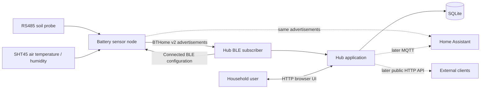
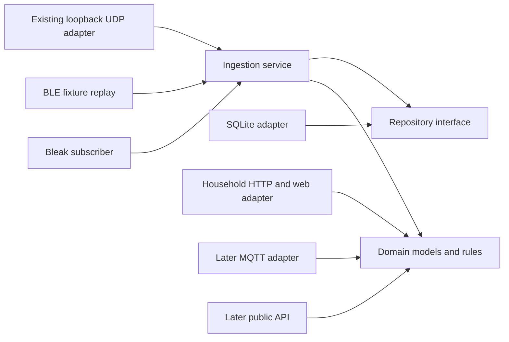

# System architecture

## Context

The sensor owns physical sampling, Modbus decoding, SHT45 I2C communication,
measurement validation, BLE advertising, and deep sleep. The hub listens for
normalized BTHome advertisements; it does not parse Modbus frames or SHT45
commands.

The hub has two first-class runtime functions: continuous BLE ingestion and a
local HTTP server for household management and monitoring. The browser server is
not the sensor transport. A stable external HTTP API and sensor Wi-Fi/HTTP
reporting are deferred until the BLE path works and measured requirements justify
them.

## Product boundaries

| Boundary | Owns | Must not own |
| --- | --- | --- |
| `sensor/` | Probe power, UART/Modbus, SHT45/I2C, scaling, BTHome advertising, sleep | History, users, analytics, downstream integrations |
| `hub/` | BLE subscription, enrollment, identity mapping, persistence, web UI, analytics, later APIs/notifications | Probe wiring or register-map assumptions |
| `protocol/` | BTHome objects, identity/deduplication semantics, units, fixtures, version policy | Platform Bluetooth or storage code |
| `deploy/` | Service definitions, Bluetooth permissions, installation, upgrades | Domain logic |

## Sensor lifecycle

The node wakes on an RTC timer, samples the SHT45, powers the soil probe, waits
for stabilization, validates Modbus registers, removes probe power, advertises a
bounded BTHome burst, stops the radio, and returns to deep sleep. A failure must
still remove probe power and sleep. An unavailable hub cannot extend the sensor's
awake period because BLE advertising does not wait for an acknowledgement.

BTHome telemetry remains one-way. A separate bounded connected-BLE service sends
plant name, room, and reporting interval when an enrolled sensor next advertises.
The sensor validates and stores those fields in NVS, reads them back as an
acknowledgement, and uses the interval for subsequent reports. Profiles, thresholds,
history, and archival state remain hub-owned.

See [sensor power management](power-management.md) for the RTC wake mechanism,
power domains, failure-safe cleanup, and current-budget method.

## Hub architecture

The hub follows dependency direction toward a platform-independent domain:

- **Domain:** telemetry, plants, thresholds, freshness, and derived results.
- **Application:** enrollment, ingestion, deduplication, retention, and care flows.
- **Adapters:** Bleak, fixture replay, development UDP, SQLite, household HTTP,
  and later MQTT, public APIs, and OS notifications.
- **Client:** the first client is the hub-hosted household web application.

Bluetooth collection, storage, and HTTP serving share one service but have
independent failure handling. A browser, MQTT broker, or future API client must
not block BLE ingestion. A Bluetooth outage must not make stored history
unavailable through the browser.

SQLite is the first durable source of truth. Another analytical database may be
used only as a later export or offline tool.

## Shared data contract and identity

Shared contracts are defined in [`protocol/`](../protocol/README.md). BTHome v2 is
the first sensor-to-hub transport. Changes require matching sensor encoder, hub
decoder, fixture, and compatibility tests.

Each stored sample needs at least:

- an enrolled hub sensor ID and documented observed BLE identifier;
- hub receipt time in UTC;
- available measurements in canonical units, with failed sources explicit and
  unavailable measurements absent;
- BTHome contract version and bounded receive diagnostics such as RSSI; and
- a packet identifier or another tested deduplication rule.

Bluetooth identifiers differ by platform and may change. Linux commonly exposes
an address while macOS exposes a CoreBluetooth UUID. Neither is automatically a
portable sensor identity. The BTHome contract must define a stable identity or the
prototype UI must state the scope of observed identifiers and support deliberate
replace/merge handling.

## Failure and trust boundaries

- Reject malformed or unsupported advertisements without terminating scanning or
  writing partial samples.
- Never reuse cached source values after a failed measurement.
- Distinguish sensor staleness from a failed Bluetooth adapter.
- Bind household HTTP to loopback by default and require explicit LAN exposure.
- Treat the existing BTHome payload and device-configuration GATT service as
  observable and unauthenticated prototype interfaces.
- Do not log encryption keys, Wi-Fi passwords, MQTT credentials, or Home Assistant
  tokens.
- Predictions are advisory; actuator control requires a separate safety design.

## References

- [BTHome v2 format](https://bthome.io/format/)
- [Bleak documentation](https://bleak.readthedocs.io/)
- [ESP-IDF NimBLE guide](https://docs.espressif.com/projects/esp-idf/en/stable/esp32c3/api-reference/bluetooth/nimble/index.html)
- [XIAO ESP32-C3 documentation](https://wiki.seeedstudio.com/XIAO_ESP32C3_Getting_Started/)