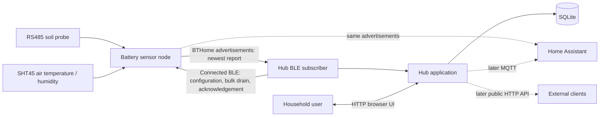
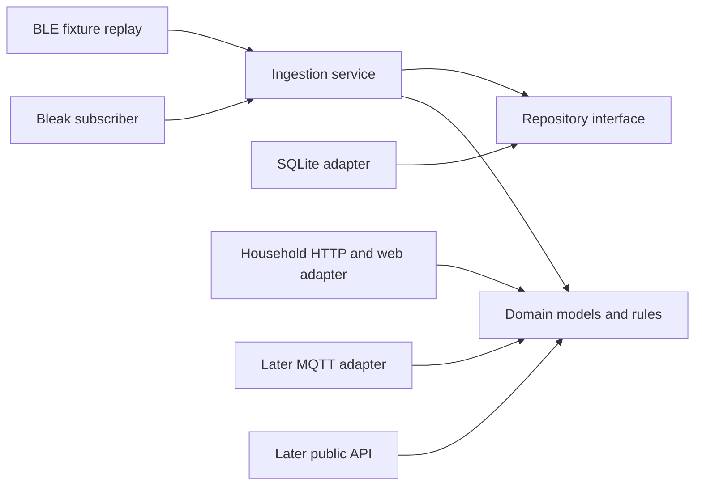
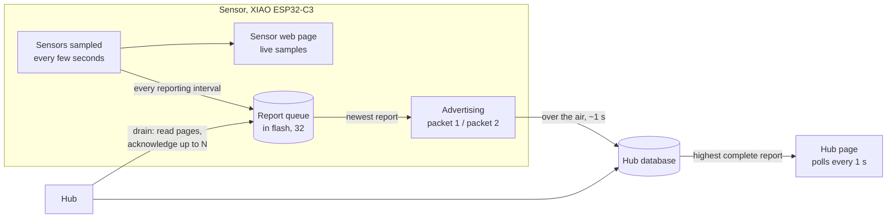

# System architecture

## Context

The sensor owns physical sampling, Modbus decoding, SHT45 I2C communication,
measurement validation, BLE advertising, and deep sleep. The hub listens for
normalized BTHome advertisements; it does not parse Modbus frames or SHT45
commands.

The hub has two first-class runtime functions: continuous BLE ingestion and a
local HTTP server for household management and monitoring. The browser server is
not the sensor transport. A stable external HTTP API and sensor Wi-Fi/HTTP
reporting are deferred until the BLE path works and measured requirements justify
them.

## Product boundaries

| Boundary | Owns | Must not own |
| --- | --- | --- |
| `sensor/` | Probe power, UART/Modbus, SHT45/I2C, scaling, BTHome advertising, sleep | History, users, analytics, downstream integrations |
| `hub/` | BLE subscription, enrollment, identity mapping, persistence, web UI, analytics, later APIs/notifications | Probe wiring or register-map assumptions |
| `protocol/` | BTHome objects, identity/deduplication semantics, units, fixtures, version policy | Platform Bluetooth or storage code |
| `deploy/` | Service definitions, Bluetooth permissions, installation, upgrades | Domain logic |

## Sensor lifecycle

The node wakes on an RTC timer, samples the SHT45, powers the soil probe, waits
for stabilization, validates Modbus registers, removes probe power, advertises a
bounded BTHome burst, stops the radio, and returns to deep sleep. A failure must
still remove probe power and sleep. An unavailable hub cannot extend the sensor's
awake period: the advertisement does not wait for anyone, and reports the hub
has not yet stored stay in the sensor's queue for a later wake.

Reports are advertised one-way, but delivery is confirmed: a sensor that
belongs to a hub keeps each report in a queue in flash until the hub, over a
connection, reads and acknowledges it (see
[how a report reaches the hub page](#how-a-report-reaches-the-hub-page)). A
separate part of the same connected-BLE service sends plant name, room, and
reporting interval when an enrolled sensor next advertises.
The sensor validates and stores those fields in NVS, reads them back as an
acknowledgement, and uses the interval for subsequent reports. Profiles, thresholds,
history, and archival state remain hub-owned.

See [sensor power management](power-management.md) for the RTC wake mechanism,
power domains, failure-safe cleanup, and current-budget method.

## Hub architecture

The hub follows dependency direction toward a platform-independent domain:

- **Domain:** telemetry, plants, thresholds, freshness, and derived results.
- **Application:** enrollment, ingestion, deduplication, retention, and care flows.
- **Adapters:** Bleak, fixture replay, SQLite, household HTTP,
  and later MQTT, public APIs, and OS notifications.
- **Client:** the first client is the hub-hosted household web application.

Bluetooth collection, storage, and HTTP serving share one service but have
independent failure handling. A browser, MQTT broker, or future API client must
not block BLE ingestion. A Bluetooth outage must not make stored history
unavailable through the browser.

SQLite is the first durable source of truth. Another analytical database may be
used only as a later export or offline tool.

## How a report reaches the hub page

Two paths carry a report, and they do different jobs:

- **Freshness: advertising.** Every reporting interval the sensor turns its
  latest samples into a report, writes it to the queue, and advertises that
  newest report straight away as two packets, alternately. The hub stores both
  from the air and shows the highest complete report as the latest. Measured at
  a 5-second interval: page updates median 5.0 s apart, 2 to 3 s behind the
  sensor's own page.
- **Completeness: the bulk drain.** Over the air the hub misses some packets. So
  it also connects and reads the sensor's queue in pages of up to eight reports,
  stores whatever it lacked, and acknowledges "up to report N"; the sensor then
  deletes those. It drains on a gap in report IDs, every 30 seconds, and on the
  first report after a restart, and waits until the report it just heard is
  complete, because a connection briefly pauses advertising. One connection
  clears any backlog in about a second.

Where things live, and what follows from it:

| Thing | Where | So |
| --- | --- | --- |
| Live samples | Sensor RAM | The sensor's own page is always current |
| Report queue | Sensor flash (NVS), up to 32 reports | Nothing is lost while the hub is down, restarting or out of range: 16 minutes at a 30-second interval, 16 hours at 30 minutes |
| History | Hub SQLite | The hub page shows only what has arrived |
| Latest reading | Hub, highest complete report ID | A report filled in later by a drain never replaces a newer one |

- **The two pages can differ for a moment.** The sensor page shows samples; the
  hub page shows the last complete report. At a 5-second interval the gap is
  normally 2 to 3 s; a report missed over the air shows up only when the next
  drain fills it in, and the page skips ahead meanwhile.
- **If the hub is down,** the queue fills at one report per interval. At 32
  the sensor stops making new reports rather than overwrite one, and its Hub
  section says so; when the hub returns, the first drain empties it.
- **Report IDs** only increase and never repeat. They are reserved in blocks of
  100 in flash, so a restart leaves a gap, which is harmless. Erasing the
  sensor's flash restarts them, and the sensor must then be removed from the
  hub and adopted again.
- **Unclaimed sensors** have no hub to acknowledge anything, so they advertise
  their latest report without queueing it.

## What a change needs deployed

| Change | Needs | Notes |
| --- | --- | --- |
| Sensor firmware | Build and flash; bump `sensor/version.txt` | By USB with `flush.sh` when the C3 is plugged in; over the air through the hub otherwise |
| Rename or refactor with identical bytes on air and in flash | Nothing on the device | The running firmware stays compatible |
| Hub code | Restart the hub service | `launchctl kickstart -k gui/$(id -u)/com.openplantpulse.hub`; it runs from the main checkout |
| Hub database schema | Rehearse on a copy, back up, restart | The migration runs at start; every step so far kept every row |
| Contract (what a packet carries) | Hub and sensor together | Restart the hub, then flash at once; the queue records its packet format and discards reports of an older one at boot, which the new hub could never accept |
| Documentation | Nothing | |

Before pushing, run `sh scripts/check.sh`. CI runs the same on Linux with GCC
in strict C11, which is stricter than macOS: POSIX-only functions such as
`strnlen` fail there. Code the host tests compile must be standard C.

## Shared data contract and identity

Shared contracts are defined in [`protocol/`](../protocol/README.md): BTHome
contract v3, whose two packets per report and exact byte budget are laid out in
its "Byte budget and worked example" section. There is one contract at a time;
a change replaces it in the sensor encoder, hub decoder and fixtures together.

Each stored sample needs at least:

- an enrolled hub sensor ID and documented observed BLE identifier;
- hub receipt time in UTC;
- available measurements in canonical units, with failed sources explicit and
  unavailable measurements absent;
- BTHome contract version and bounded receive diagnostics such as RSSI; and
- the sensor's report ID, which never repeats: the hub keys each report by
  `(sensor, report ID)`, so repeats are duplicates and a backfilled report
  lands in its place.

Bluetooth identifiers differ by platform and may change. Linux commonly exposes
an address while macOS exposes a CoreBluetooth UUID. Neither is automatically a
portable sensor identity. The BTHome contract must define a stable identity or the
prototype UI must state the scope of observed identifiers and support deliberate
replace/merge handling.

## Failure and trust boundaries

- Reject malformed or unsupported advertisements without terminating scanning or
  writing partial samples.
- Never reuse cached source values after a failed measurement.
- Distinguish sensor staleness from a failed Bluetooth adapter.
- Bind household HTTP to loopback by default and require explicit LAN exposure.
- Treat the existing BTHome payload and device-configuration GATT service as
  observable and unauthenticated prototype interfaces.
- Do not log encryption keys, Wi-Fi passwords, MQTT credentials, or Home Assistant
  tokens.
- Predictions are advisory; actuator control requires a separate safety design.

## References

- [BTHome v2 format](https://bthome.io/format/)
- [Bleak documentation](https://bleak.readthedocs.io/)
- [ESP-IDF NimBLE guide](https://docs.espressif.com/projects/esp-idf/en/stable/esp32c3/api-reference/bluetooth/nimble/index.html)
- [XIAO ESP32-C3 documentation](https://wiki.seeedstudio.com/XIAO_ESP32C3_Getting_Started/)