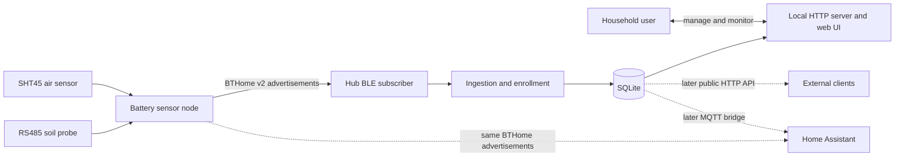

# Open Plant Pulse hub

## Goal and priorities

Open Plant Pulse has one hub project: the Python service in [`hub/`](../hub/).
The hub has two primary responsibilities:

1. Run a BLE/BTHome subscriber that continuously listens for nearby sensor
   advertisements, validates them, and stores readings in SQLite.
2. Host a local HTTP server where household users can discover, name, manage, and
   monitor sensors and plants through a web browser.

BLE/BTHome ingestion is the first sensor transport. The HTTP server is still a
core product surface, but it initially serves the hub-owned web application and
only the internal endpoints needed by that application. A stable public HTTP API,
sensor-to-hub Wi-Fi/HTTP reporting, MQTT, and other integrations are lower-priority
follow-up work.

> [!IMPORTANT]
> BTHome advertisements remain one-way telemetry. Firmware 0.3.0 adds a separate,
> bounded connected-BLE service: after the next report, the hub can send plant name,
> room, and reporting interval and verify them by read-back. The prototype service
> is unauthenticated and must not be treated as secure provisioning.

The checked-in vertical slice retains loopback UDP from the simulator and a
standard-library HTTP dashboard. It now also includes a Bleak BTHome subscriber,
stable sensor-owned identity, packet deduplication, deterministic replay, explicit
SQLite migrations, partial-source storage, and separate scanner/database health.
These paths are host-tested with captured advertisements. The browser now includes
hub health, an unclaimed-sensor inbox, an enrolled fleet overview, sensor-scoped
monitoring, and hub-owned management workflows. CoreBluetooth discovery and scanner
startup have been exercised on macOS; physical BTHome reception and Linux remain
unvalidated.

## Target architecture



The hub remains one background service and one operational SQLite database. The
BLE subscriber and HTTP server run independently: a browser or downstream client
failure must not stop collection, and a temporary Bluetooth failure must not make
stored history unavailable.

Reliable BLE ingestion and persistence take priority over dashboard polish,
analytics, public APIs, MQTT, notifications, and other downstream capabilities.
The implementation should extend the current `sqlite3` store and standard-library
`ThreadingHTTPServer` before adding another framework or storage abstraction.

## Technology baseline

| Concern | Baseline | Reason |
| --- | --- | --- |
| Runtime | Python 3.9+ | Supported by the existing package |
| Sensor ingestion | Passive BTHome v2 advertisements over BLE | Low sensor wake-cycle energy and no Wi-Fi association |
| BLE adapter | `bleak` | Already declared; supports macOS CoreBluetooth and Linux BlueZ |
| HTTP service | Python standard-library threaded server initially | Already powers the tested browser slice |
| Store | SQLite through Python `sqlite3` | Embedded, transactional, and already implemented |
| Home Assistant | Direct BTHome first; hub MQTT later | The same broadcast can be heard without coupling HA to the hub |
| Tests | `unittest` baseline; `pytest` development extra | Zero-dependency core checks and optional richer tooling |

The store uses standard-library `sqlite3`; do not introduce asynchronous database
access unless the BLE runtime demonstrates a need for it. Keep Bluetooth callbacks
short: normalize an advertisement and hand it to application/storage code without
blocking the scanner.

## Current development setup

From the repository root:

```sh
python3 -m venv .venv
. .venv/bin/activate
python3 -m pip install -e './hub[dev]'
pytest hub/tests
```

The current contract and hub tests need no installation:

```sh
PYTHONPATH=hub/src python3 -m unittest discover -s hub/tests
```

Run the existing simulated vertical slice:

```sh
PYTHONPATH=hub/src python3 -m open_plant_pulse_hub
```

In another terminal:

```sh
python3 simulator/sensor.py --time-scale 60
```

Visit <http://127.0.0.1:8080>. The simulator currently sends full measurement
sets through development-only UDP on `127.0.0.1:8765`. The hub exposes these
implementation endpoints for its current page:

- `GET /api/health`
- `GET /api/sensors?status=unclaimed|enrolled|archived`
- `GET /api/sensors/<sensor-id>`
- `GET /api/settings`
- `GET /api/readings/latest`
- `GET /api/readings/history`
- `GET /api/care-log`
- `GET /api/raw-reports?sensor_id=<sensor-id>` (temporary debugging surface)
- `PUT /api/sensors/<sensor-id>`
- `PUT /api/sensors/<sensor-id>/name`
- `PUT /api/sensors/profile`
- `PUT /api/settings`
- `DELETE /api/sensors/<sensor-id>`
- `POST /api/sensors/<sensor-id>/archive`
- `POST /api/sensors/<sensor-id>/replace`

These routes are an internal browser contract, not the promised public HTTP API.
They may evolve as the multi-sensor UI is built. State-changing routes reject a
browser `Origin` that does not match the request `Host`; requests without `Origin`
remain available to local command-line tools. The server binds to loopback unless
`--host` is explicitly supplied. For LAN use, bind to a private interface only,
restrict the port with the host firewall, and do not expose it to the Internet.
UDP remains loopback-only test infrastructure; deterministic BLE tests use the
advertisement replay adapter.

### Native Bluetooth setup

Install the hub in the repository virtual environment before using BLE:

```sh
python3 -m venv .venv
. .venv/bin/activate
python3 -m pip install -e './hub[dev]'
```

On macOS, Bleak uses CoreBluetooth. The first scan should prompt for Bluetooth
access; if access was denied, enable the terminal or packaged hub under **System
Settings → Privacy & Security → Bluetooth**. A future bundled application must
include `NSBluetoothAlwaysUsageDescription` in its `Info.plist`. CoreBluetooth
reports host-scoped UUIDs rather than portable Bluetooth addresses, which is why
the hub does not use them as sensor identity.

On Linux, Bleak communicates with BlueZ over the system D-Bus. Ensure BlueZ is
installed, the Bluetooth service and adapter are enabled, and the service account
can access the system D-Bus and BlueZ discovery APIs. Do not run the hub as root as
a substitute for correct service permissions. Container or user-namespace
deployment needs explicit D-Bus and adapter access and remains unvalidated.

Start the hub and inspect scanner/database state independently:

```sh
open-plant-pulse-hub
curl --fail --silent http://127.0.0.1:8080/api/health
```

`scanner.status` should become `scanning`; permission or adapter failures appear as
`unavailable` with `last_error`. `last_receive_at` remains null until a supported
`0xFCD2` advertisement has decoded successfully. `database.status` reports SQLite
health separately. Use `--no-ble` only when intentionally disabling collection.

## BLE/BTHome subscriber design

### Scan behavior

The subscriber must:

- use observation-only scanning for telemetry; Bleak's active discovery mode remains
  enabled so the `sensor-<DEVICE_ID>` local-name scan response is available on macOS
  and Linux;
- filter service data for BTHome UUID `0xFCD2` in the discovery callback before
  decoding; do not use a scanner-level service UUID filter because CoreBluetooth
  suppresses the sensor's valid service-data-only advertisements when it is set;
- accept only supported BTHome v2 device-info flags and object layouts;
- record the hub receipt time, source adapter, observed Bluetooth identifier, and
  RSSI when the platform provides them;
- reject malformed or unsupported advertisements without stopping the scan loop;
- reconnect with bounded backoff after adapter loss; and
- expose scanner state and the last successful advertisement time to hub health.

For an enrolled sensor with pending device configuration, the subscriber opens one
bounded GATT connection using the platform-observed identifier, writes the versioned
payload, and reads it back. Matching bytes acknowledge application; connection,
write, or read-back failures remain visible as retrying and are attempted on a later
report. The hub records the sensor's reporting interval only from that matching
read-back; saving a new hub interval leaves the last confirmed sensor interval
unchanged until synchronization succeeds. The hub does not connect when no
configuration is pending.

`bleak` presents platform-specific device identifiers: Linux commonly exposes a
Bluetooth address while macOS exposes a CoreBluetooth UUID. Neither is guaranteed
to be portable across hosts or OS resets. Identity must therefore be an explicit
part of the enrollment design rather than an undocumented use of `device.address`.

Contract v2 uses the complete BLE local name `sensor-<DEVICE_ID>`, where `DEVICE_ID`
is the sensor's immutable 48-bit hardware device ID encoded as 12 lowercase
hexadecimal digits. The advertised name and hub canonical ID both use
`sensor-<lowercase-device-id>`. During firmware transitions, previous uppercase
`sensor-<DEVICE_ID>` and legacy uppercase `OPP-<DEVICE_ID>` advertisements are
accepted and mapped to the same canonical identity so history and enrollment remain
continuous.
This sensor-owned identity survives sensor reset, hub replacement, and changes to
the Linux address or macOS CoreBluetooth UUID. Platform identifiers remain bounded
receive diagnostics only. The identifier is observable and spoofable under the
unencrypted contract.

The first valid supported advertisement may create an **unclaimed** sensor record.
The user then assigns a display name, plant, profile, and room. Unknown BTHome
devices must not silently appear as trusted Open Plant Pulse sensors unless the UI
offers an enrollment window or an allowlist policy.

### Duplicate and partial advertisements
The sensor increments BTHome packet ID `0x00` modulo 256 once per new wake-cycle
sample and holds it constant through the advertisement burst. The ingestion path
compares packet IDs within stable sensor identity and stores duplicate callbacks as
bounded diagnostics without creating readings. Database uniqueness provides a
second guard for deterministic captured replay across restart.
Packet-ID wraparound is valid after intervening accepted samples; any time-window
fallback must be documented as heuristic and must not collapse distinct
equal-valued samples.

A failed source omits that source's complete object group. Soil requires `0x02`,
`0x14`, and `0x56`; air requires `0x03` and `0x45`. The hub stores source
availability with the reading and never fills a missing value from an earlier wake
cycle. Incomplete groups are malformed. Contract changes require matching fixtures,
sensor encoder tests, hub decoder tests, and hardware compatibility checks.

### Security and privacy

The current BTHome payload is unencrypted. Anyone in radio range can observe
measurements and device presence, and the hub cannot cryptographically authenticate
the sender. Initial deployment is therefore suitable only for local environmental
monitoring where that exposure is accepted.

Before claiming authenticated or private sensor ingestion, select and test BTHome
encryption/key provisioning or another authenticated transport. Never log keys,
credentials, or complete long-lived identifiers unnecessarily.

## Persistence model

SQLite remains the single source of truth. Add explicit, transactional migrations
instead of modifying the existing version-1 schema in place. The target model
needs at least:

### `sensors`

- internal stable sensor ID;
- enrollment status and chosen identity material;
- display name, room, plant assignment, and profile;
- first/last seen receipt times and latest RSSI;
- transport/contract version and archival state.

### `advertisements`

- sensor ID and deduplication key;
- hub receipt time and optional sensor sequence/packet ID;
- supported BTHome contract version;
- bounded source metadata and decode status.

### `readings`

- advertisement ID and sensor ID;
- available measurements in canonical units;
- explicit source status for partial samples; and
- no fabricated values for unavailable sources.

### `care_events`

- stable event ID and sensor ID;
- type, time, confidence, summary, and bounded changes.

Retention is indefinite for the prototype. Add backup, export, aggregation, and
retention controls only after representative database growth is measured.

## Household web experience

The HTTP server should make normal use possible without command-line tools.
Deliver the smallest useful multi-sensor workflow in this order:

1. **Hub health:** BLE adapter/scanner state, database state, uptime, and last
   successful receive time.
2. **Sensor inbox:** newly observed, unclaimed Open Plant Pulse devices with a
   deliberate enrollment action.
3. **Fleet page (`/`):** cards showing each sensor's name, stable identifier, last
   report time, and current state.
4. **Sensor detail (`/sensors/<id>`):** monitoring, history, care-event, plant-health,
   and all configuration controls scoped to one sensor. This page also exposes the
   editable hub-requested reporting interval, the read-only interval last confirmed
   from firmware, and pending/applied/retrying delivery state.

The UI must distinguish:

- **fresh**, based on a configured expected advertising/reporting interval;
- **stale**, after a documented grace period;
- **never received** or **source unavailable**; and
- **scanner unavailable**, which is a hub fault rather than proof that every
  sensor is offline.

Configuration controls do not imply an immediate change. The hub stores a desired
revision and sends plant name, room, and reporting interval when the sensor next
reports. Firmware persists an accepted revision and uses its interval for subsequent
reports. Until read-back confirms the desired revision, the UI and freshness logic
continue to use the last confirmed sensor interval. Profile and alert settings remain
hub-only.

The server binds to loopback by default. LAN exposure for household access must be
explicit and documented with host firewall guidance. State-changing browser
routes require same-origin checks and CSRF protection before LAN mode is treated
as production-ready. Internet exposure and cloud accounts are out of scope.

## HTTP scope and priority

### Priority now: hub web application

Maintain only the routes needed to render and operate the local web UI, plus a
small health endpoint for service diagnostics. These endpoints may remain an
internal contract while the domain and multi-sensor workflows stabilize.

### Lower priority: public HTTP API

A versioned public API for external programs is deferred until BLE ingestion,
identity, persistence, and the household UI are reliable. When scheduled, define
read-only sensor/history endpoints first, then authenticated management endpoints,
with pagination, date bounds, request limits, and compatibility policy.

### Lower priority: sensor Wi-Fi/HTTP transport

Sensor-initiated HTTP reporting remains an optional future transport for use cases
that require acknowledged delivery, larger diagnostics, or configuration replies.
It is not on the critical path for the first hub. Do not provision hub URLs or
tokens in production sensor firmware until complete wake-cycle energy, outage,
authentication/TLS, and retry behavior have been measured against BLE.

## Runtime and package structure

Grow toward the following boundaries without rewriting the tested vertical slice:

```text
open_plant_pulse_hub/
├── domain/          Telemetry, plant profiles, freshness, and care rules
├── application/     Enrollment, ingestion, queries, and management use cases
├── ingestion/       BTHome decode, Bleak subscriber, and replay/UDP test adapters
├── adapters/        SQLite, HTTP, Bluetooth platform, MQTT, and OS adapters
└── static/          Local household web application
```

Keep platform Bluetooth code behind an adapter so parsing and ingestion can be
tested with captured advertisements on hosts without BLE hardware. The service
must shut down the scanner, HTTP server, and database cleanly on termination.

## Delivery plan

### Phase 1: Freeze the BLE contract and replay path — complete

- [x] Decide BTHome identity, packet/deduplication, SHT45 semantics, and partial-source
  behavior.
- [x] Add versioned fixtures for valid, duplicate, partial, malformed, unknown-object,
  and multi-sensor advertisements.
- [x] Extend encoder/decoder host tests together.
- [x] Add a deterministic advertisement replay adapter that feeds the same ingestion
  interface as Bleak; retain loopback UDP only for existing UI regression tests.

**Exit:** at least three fixture-backed sensors can be replayed repeatedly without
identity collisions, stale-value fabrication, or duplicate durable samples.

**Completed 2026-09-13:** deterministic full-capture replay before and after a
SQLite restart retains four distinct readings across three stable sensor identities.
Duplicate callbacks and repeated captured packets remain diagnostics rather than
durable readings, and unavailable source groups remain null.

### Phase 2: BLE subscriber and persistence — complete with captured evidence

- [x] Implement the Bleak subscriber for BTHome service data.
- [x] Add versioned migrations for sensors, advertisements, readings, and enrollment.
- [x] Persist normalized readings and bounded receive metadata transactionally.
- [x] Recover from malformed advertisements and Bluetooth adapter interruptions.
- [x] Expose scanner/database health independently of sensor freshness.

**Exit:** macOS and Linux tests or captured evidence show continuous collection,
restart recovery, deduplication, and isolation between at least three sensors.

**Completed 2026-09-13 using captured evidence:** the production scanner callback,
queue, ingestion, and SQLite path recovers after a simulated adapter interruption
and isolates the same three captured sensors. Migration, restart, deduplication,
malformed-device isolation, bounded diagnostics, and independent health paths are
host-tested. Native scanner startup was exercised on macOS, but physical BTHome
reception, Linux BlueZ permissions, and multi-sensor radio behavior remain pending
hardware validation and are not claimed by this completion status.

### Phase 3: Household management and monitoring server

- Add hub health, sensor inbox, fleet overview, and per-sensor pages.
- Add name, room, plant/profile, thresholds, archive, and replace/merge workflows.
- Add history and care-event views scoped by sensor.
- Keep the HTTP server loopback-only by default; document explicit LAN mode.
- Add browser-route integration tests and responsive desktop/mobile checks.

**Exit:** a household user can enroll, identify, manage, and monitor at least three
BLE sensors through a browser without using the terminal or mixing their data.

**Implementation status:** complete for replayed sensors. Browser routes and store
tests exercise three isolated identities, enrollment, a dedicated fleet page,
sensor-detail deep links, detail-page configuration and deletion, persisted sensor-specific
freshness intervals, and scoped history. Destructive deletion removes readings, care events,
advertisements, and orphaned plant metadata. Responsive layouts are implemented in
CSS; physical multi-sensor and interactive browser checks remain part of hardware
validation.

### Phase 4: Physical BLE and power validation

- Implement the bounded ESP32-C3 BTHome advertising lifecycle and deep sleep.
- Bump `sensor/version.txt`, build with `sensor/firmware/build.sh`, flash with
  `sensor/firmware/flush.sh`, and verify the running version.
- Verify repeated wake/measure/advertise/sleep cycles under normal and degraded
  radio conditions.
- Measure complete-cycle and deep-sleep energy, advertisement reception rate, and
  battery-life estimates at intended reporting intervals.
- Soak the hub and physical sensors for at least 24 hours.

**Exit:** hardware evidence distinguishes build, flash, running-version, BLE
delivery, restart/soak, and power results; none is inferred from another.

**Implementation status:** started. Firmware 0.3.0 includes an opt-in production
lifecycle that takes one fresh SHT45 reading, emits a contract-v2 air-only BTHome
advertisement for a fixed window, stops NimBLE, configures timer wake-up, and enters
deep sleep. With that lifecycle disabled, development firmware remains awake and
uses the latest valid SHT45 sample. An unconfigured development image reports every
five seconds; after configuration, both modes use the persisted interval. The GATT
delivery/read-back path is host-tested and 0.3.0 builds, but has not been flashed or
physically verified. Firmware 0.2.1 was previously flashed and verified. Soil UART
acquisition, verified probe-power control, configuration security/energy, repeated
production cycles, power, and 24-hour soak evidence remain pending.

### Phase 5: Service packaging and resilience

- Add launchd and systemd definitions after native BLE permissions are understood.
- Verify startup after reboot, clean shutdown, migration, backup, and rollback.
- Test LAN dashboard access and firewall instructions on macOS and Linux.
- Document Bluetooth permission and Linux BlueZ requirements.

**Exit:** a clean supported-host install survives reboot and resumes BLE collection
without manual terminal steps.

### Later: public API, integrations, and alternate transport

- Stabilize and version a public read-only HTTP API.
- Add authenticated management API operations only when required.
- Add MQTT discovery/state publishing and native notifications.
- Re-evaluate sensor Wi-Fi/HTTP or a hybrid mode using measured energy, delivery,
  configuration, and security requirements.

## Acceptance criteria for the first hub release

- The hub continuously subscribes to supported BTHome advertisements.
- At least three physical or replayed sensors retain distinct identities and data.
- Duplicate callbacks do not create duplicate stored samples.
- Partial measurements never reuse stale values from an earlier advertisement.
- Readings persist across hub restart in versioned SQLite storage.
- BLE adapter failure is visible and does not make stored history unavailable.
- A household user can enroll, name, assign, archive, and monitor sensors in the
  local browser UI.
- The UI never presents hub-owned metadata changes as sensor configuration.
- HTTP binds to loopback by default and documented LAN mode is explicitly enabled.
- Existing repository checks and schema migration tests pass.

## Decisions still required before the first hub release

Identity, packet deduplication, SHT45/partial-source semantics, and initial
unencrypted operation are frozen in protocol contract v2. Remaining decisions and
validation are:

1. complete Bluetooth adapter and permission validation on supported macOS/Linux hosts;
2. verify Home Assistant behavior for the contract-v2 identity and temperature objects;
3. decide whether authenticated telemetry justifies bind-key provisioning in a later
   encrypted contract; and
4. decide whether future remote configuration justifies connected BLE, Wi-Fi/HTTP, or a
   hybrid transport.
