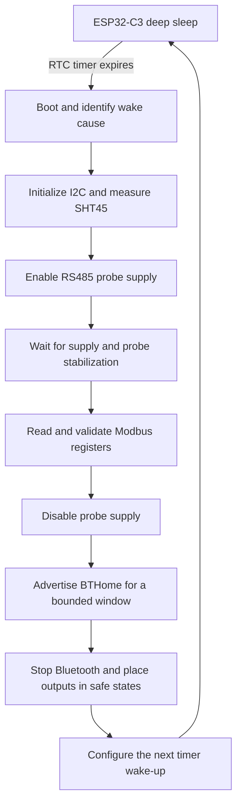

# Sensor power management

This document describes the intended power lifecycle of the battery-powered
Open Plant Pulse sensor node. It separates the target design from the current
implementation so that planned behavior is not mistaken for tested hardware.

## Implementation status

The target sensor wakes on a timer, measures the SHT45, powers and reads the
RS485 soil probe, advertises one BTHome sample for the hub and any nearby Home
Assistant receiver, and returns to deep sleep.

The checked-in ESP32-C3 application provides powered bench diagnostics and an
opt-in production mode. Production mode performs one fresh SHT45 acquisition,
runs a bounded BTHome advertising window, stops the radio, and enters timer deep
sleep. This path builds but is not physically validated. Modbus acquisition of
the soil probe works in the always-awake development mode (firmware 0.13.3).
Probe power is switched by an AO3400 MOSFET in the MT3608's ground, driven
from GPIO10 (firmware 0.15.0). The MT3608 and probe draw 28.5 mA from the
battery while on. Since 0.20.0 the always-awake path also powers the probe only
for each reading, as the production path always has: on, warm up, read, off,
leaving it unpowered for the rest of the sampling interval. pH needs a long
warm-up after each power-on, which is the open question for both paths: a
per-reading cycle buys the current back and pays for it in the first pH. Complete
assembled-node power measurements remain pending.

## Why deep sleep

The sensor is expected to spend most of its life waiting between measurements.
Leaving the ESP32-C3, Bluetooth radio, RS485 interface, boost converter, and
soil probe active during that wait would waste battery energy.

ESP32-C3 deep sleep turns off most of the main digital system, including the
CPU and high-frequency clocks, while retaining a small low-power domain that
can detect configured wake-up events. This is closer to a controlled shutdown
and reboot than to pausing an application. Firmware should expect execution to
start again through the normal boot path after a deep-sleep wake-up and should
not depend on ordinary RAM surviving.

Deep sleep is low power, not zero power. The battery still supplies the board's
regulator, the ESP32-C3 low-power domain, and any external component connected
to a rail that remains enabled.

## Power and data lifecycle



The sensor owns physical acquisition and measurement validation. The hub cannot
wake the sensor, poll the soil probe, or acknowledge a BTHome advertisement.
Missing expected advertisements are therefore how the hub detects that a sensor
may be offline. Hub-owned names and plant settings do not change sensor behavior.

## RTC timer wake-up

RTC means real-time clock, but in this design the important feature is the
ESP32-C3's low-power timer rather than a battery-backed calendar clock.

Before entering deep sleep, firmware configures a timer wake-up interval. The
default project setting is 30 minutes. A low-frequency clock continues running
inside the powered low-power domain while the CPU, radio, and normal peripheral
clocks are off. When the programmed interval expires, the wake controller
restores the main chip domains and starts the normal boot sequence.

The timer receives energy from the same 18650 battery as the rest of the node:

```text
protected 18650 cell
        |
        v
board protection and regulation
        |
        v
ESP32-C3 low-power domain
        |
        v
slow clock, RTC timer, and wake controller
```

There is no separate RTC battery in the reference prototype. Removing or fully
disconnecting the 18650 stops the timer as well as the rest of the sensor.
It also invalidates the retained clock state. Deep sleep retains ESP-IDF system
time because the RTC slow clock remains powered.

### Wall-clock synchronization

The firmware validates wall-clock time by value rather than inferring validity
from reset reason. Dates from 2024-01-01 through 2099-12-31 are plausible. Once a
configured Wi-Fi connection has an address, an invalid clock receives a bounded
SNTP synchronization attempt. Failure leaves sampling available and marks those
samples as sequence-relative rather than assigning fabricated calendar dates.
When the development web UI is disabled, firmware skips Wi-Fi while the clock is
current and limits a required clock-only Wi-Fi session to 30 seconds by default.

The internal RC slow clock is corrected opportunistically every 12 hours by
default, configurable from 6 to 24 hours. Forward and backward corrections do
not rewrite timestamps already captured. Each sample retains a sequence number
and monotonic offset, so samples remain ordered across deep-sleep cycles even
when UTC is unavailable. Removing the battery resets that retained sequence and
clock state; the hub remains responsible for durable history and receipt time.

The low-power clock may be less accurate than the main crystal. Wake interval
drift should be measured on the real board, but modest drift is acceptable for
plant sampling because the hub records its own receipt timestamp.

The ESP-IDF implementation is expected to follow this pattern after all outputs
have been placed in their safe state:

```c
const uint64_t interval_us =
    (uint64_t)device_config.reporting_interval_seconds * 1000000ULL;

esp_sleep_enable_timer_wakeup(interval_us);
esp_deep_sleep_start();
```

### Dynamic wake intervals

The 30-minute project setting is a default, not a permanent hardware interval.
Firmware can choose a different delay before every deep-sleep cycle. For
example, a node can wake after 30 minutes, take a measurement, decide that a
rapid change needs closer observation, and schedule its next wake-up for 10
minutes later.

```c
uint32_t next_interval_minutes = CONFIG_OPP_SAMPLE_INTERVAL_MINUTES;

if (soil_moisture_is_changing_quickly()) {
  next_interval_minutes = 10;
}

const uint64_t next_interval_us =
  (uint64_t)next_interval_minutes * 60ULL * 1000000ULL;

esp_sleep_enable_timer_wakeup(next_interval_us);
esp_deep_sleep_start();
```

The selected delay applies to the next sleep only. After the ESP32-C3 wakes,
firmware evaluates the current conditions and configures the following delay
before sleeping again. This supports policies such as faster sampling after
watering or during rapid change and slower sampling during stable periods.

The CPU cannot revise the timer after deep sleep has started because normal
application code is no longer running. The hub therefore delivers configuration
during a connectable report window; the newly persisted interval controls the next
sleep. Policies that depend on earlier cycles must deliberately reconstruct or
retain state in RTC memory or nonvolatile storage. Firmware skips identical writes
to limit flash wear. Connected-BLE energy and security still require physical
measurement and hardening.

The final code must inspect the wake cause when useful, handle cold boot and
timer wake consistently, and avoid relying on non-retained state.

## Power domains by component

| Component | Measurement | Advertisement window | Deep sleep target |
| --- | --- | --- | --- |
| ESP32-C3 CPU and main clocks | On | On | Off |
| ESP32-C3 low-power timer | On | On | On at low power |
| Wi-Fi radio | Off in production; optional for bench clock/UI | Off | Off |
| Bluetooth radio | Off | On for a bounded BTHome burst | Off |
| SHT45 | Measuring briefly | Idle | Idle or explicitly power-gated |
| RS485 transceiver | On | Off | Off |
| Probe boost converter | On | Off | Off |
| Soil probe | On | Off | Off |
| Battery protection and board regulator | On | On | On with quiescent loss |

These are design targets. Actual current and rail states must be measured on
the complete assembly.

## SHT45 behavior during deep sleep

The SHT45 measures ambient air temperature and relative humidity over I2C. It
supports one-shot measurements and does not need to measure continuously.

Whether current reaches it during ESP32-C3 deep sleep depends on the final
wiring:

- If its breakout is connected to an always-on 3.3 V rail, it remains powered
  in its low-power idle state while the ESP32-C3 sleeps.
- The persisted web-console SHT45 toggle suppresses I2C probing and measurement
  and releases the bus, but cannot remove this always-on standby current.
- If it is supplied through a verified load switch, firmware can remove its
  power between measurement cycles.

Keeping the SHT45 powered may be reasonable because the sensor IC has a low
standby current. The complete breakout can consume more than the IC because of
pull-ups, regulators, level shifters, or a power LED. Its actual idle current
must therefore be measured rather than inferred from the SHT45 datasheet alone.

I2C pins must not back-power an unpowered breakout. If the SHT45 rail is
switched off, SDA and SCL states and pull-up placement must be designed so that
current cannot flow through protection diodes. If it remains powered, the bus
must be left in a valid idle state before deep sleep.

## RS485 soil probe behavior during deep sleep

The NPKPHCTH-S soil probe is a much larger load and may require a boosted supply.
It must not remain operational throughout the sleep interval.

The intended sequence is:

1. Keep the probe rail disabled at reset and during deep sleep.
2. Enable the expansion board or load switch after the ESP32-C3 wakes.
3. Wait for the rail, RS485 interface, and probe electronics to stabilize.
4. Send bounded Modbus RTU requests and validate response lengths and CRCs.
5. Disable probe power before BLE advertising or deep sleep.

A low GPIO level does not by itself prove that probe current is zero. The
assembled interface must be checked for:

- Boost-converter shutdown and quiescent current.
- True load disconnection at the probe supply output.
- RS485 transceiver standby current.
- Back-power paths through UART, RS485, or protection components.
- Enable-pin behavior during reset and deep sleep.

The candidate expansion-board enable signal is not yet verified. Existing
source material conflicts between GPIO3 and the XIAO D3 pin, which maps to
GPIO5. Firmware must not energize the probe until the exact board schematic or
a continuity test resolves this.

## Failure-safe cleanup

Every path that enables a high-current rail must also guarantee that it is
disabled. Probe power must be removed when:

- Modbus initialization fails.
- A request times out.
- A response has an invalid CRC or unexpected length.
- The SHT45 fails.
- BTHome encoding or advertising fails.
- A later processing step returns an error.

Cleanup should be centralized so normal and error paths use the same shutdown
logic. Watchdogs and reset defaults are additional safeguards, not substitutes
for a verified power-enable circuit with a safe inactive state.

The sensor must not report or advertise cached measurements as though they were
new. A failed source is represented by a status and omitted values. The report may
retain valid values from other sources, but never stale values from an earlier
cycle.

## Estimating battery life

Average current depends on both active and sleeping phases:

```text
average current =
    (active current * active duration
     + sleep current * sleep duration)
    / complete cycle duration
```

Approximate battery life is then:

```text
battery life in hours = usable battery capacity in mAh / average current in mA
```

The estimate must include the complete assembly, not only the ESP32-C3:

- XIAO board deep-sleep current.
- SHT45 breakout standby current.
- RS485 interface and boost-converter shutdown current.
- Battery protection and regulator losses.
- Probe startup and measurement current.
- BTHome radio startup, advertising current, burst duration, and repeat count.
- Optional bench Wi-Fi/SNTP energy, excluded from production estimates unless the
  production design retains it.
- Temperature, battery aging, and usable-capacity margin.

The XIAO documentation's approximate 44 microamp deep-sleep figure is only a
board-level starting point. It is not a validated system current for this
product.

## Accelerated testing needs real firmware changes

Nothing on the hub can make a physical ESP32-C3 timer run faster: a node
configured for 30 minutes wakes after approximately 30 real minutes. Testing
long-duration behavior quickly requires a temporarily shorter firmware sampling
interval, and hub offline detection must use the sensor's real expected
reporting cadence either way.

## Verification requirements

Before treating this design as complete, verify on the assembled prototype:

- Probe power is off at reset and throughout deep sleep.
- SHT45 idle or switched-off current matches the chosen design.
- No signal line back-powers an unpowered peripheral.
- Wake interval and drift are acceptable.
- Stabilization delay includes measured margin.
- Every failure path removes probe power.
- BTHome advertising ends before deep sleep.
- An unavailable hub does not extend the bounded advertisement window.
- Complete-cycle and deep-sleep current profiles are recorded.
- Battery-life estimates use measured system current.

The actionable bench checks are maintained in
[`bring-up.md`](bring-up.md), while component and wiring assumptions remain in
[`../sensor/hardware/README.md`](../sensor/hardware/README.md).
