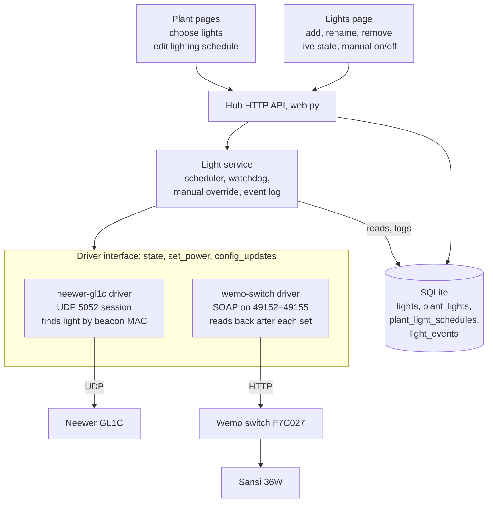

# Grow light control

## Status

Accepted 2026-09-27. Implemented, and cut over on the hub computer on
2026-09-27: both lights are driven by the hub and confirmed on and off, and the
schedule switched them on at a window edge and held them through a hub restart.
The GL1C's colour by eye, an off edge, and network-drop recovery are still to
check.

## Decision and scope

The hub manages lights, and each light's type is handled by its own driver. A plant
picks which lights it uses and owns its own lighting schedule. A light belongs to
at most one plant. One scheduler in the
hub turns the chosen lights on and off. It replaces the standalone `gl1cd`
controller rather than talking to it.

The device protocols come from the working `glowlight` project: `gl1cd.py`,
the controller that ran both lights before the hub, and its `HARDWARE.md`
protocol notes. The drivers in `hub/src/open_plant_pulse_hub/lighting/` carry
the facts that matter in their docstrings.

In scope for the first release:

- A **Lights** page to add, rename and remove lights. Adding a light means picking a
  light type (Neewer GL1C, Wemo-switched light) and filling in that type's
  connection settings.
- A **driver** per light type that hides how the light is controlled. The rest of the
  hub only asks a driver to turn a light on or off and to report its current state.
- On a plant's pages, a **light picker** for one or more lights, and a **lighting
  schedule editor** for that plant.
- A **scheduler** in the hub that turns schedules into on/off commands, confirms
  each one, corrects drift and backs off after manual control. It carries over the
  rules that already work in `gl1cd`.
- **Manual on/off** for each light from the Lights page.

Out of scope for now: colour scenes over the day (sunrise ramps), light-level
sensing, lights shared across hubs, and any vendor cloud. The GL1C's colour preset
stays a per-light setting, not part of the schedule.

## Data model

Three new tables in schema version 21: `lights`, `plant_lights` and
`plant_light_schedules`, plus a `light_events` log. The schedule hangs off
`plants.plant_id`, not off a light or a sensor, so it belongs to the plant and
survives replacing its sensor (`replace_sensor` already carries `plant_id` over).

Today a plant row is created when a sensor is adopted (`manage_sensor`) and deleted
when its last sensor is deleted (`delete_sensor`), and the UI addresses plants by
sensor id. The new tables key on `plant_id`; the API keeps taking a sensor id and
the store resolves it to the plant.

| Table | Columns | Notes |
| --- | --- | --- |
| `lights` | `light_id` (text, e.g. `light-3f2a`), `display_name`, `driver` (`neewer-gl1c`, `wemo-switch`), `config` (JSON), `created_at` | `config` is owned by the driver: the GL1C holds `mac`, `last_ip`, `preset {brr, cct, gm}`; the Wemo holds `host`, `last_port`. The hub never reads inside it. |
| `plant_lights` | `light_id` (primary key), `plant_id` | A plant can use several lights; a light belongs to at most one plant, so two schedules never compete for it. Deleting a light removes its link. |
| `plant_light_schedules` | `plant_id` (primary key), `enabled`, `on_time` (`HH:MM`), `off_time` (`HH:MM`), `updated_at` | One daily window per plant, in the hub's local time. It may wrap midnight. `on_time = off_time` is refused. |
| `light_events` | `event_id`, `light_id`, `at`, `source` (`schedule`, `watchdog`, `manual`), `wanted`, `outcome`, `detail` | A short log for the Lights page and for debugging, trimmed like the receive diagnostics. |

Runtime state (online, last known power, subscribed, manual override deadline) stays
in memory in the light service, as `gl1cd` does. Only facts a driver learns and must
keep, such as the GL1C's MAC or new IP, are written back into `lights.config`.

## Driver abstraction

Every light type is a driver class registered under a name. The scheduler, API and
pages only call this interface; everything device-specific (UDP sessions, SOAP, port
walks, colour presets) stays inside the driver.

```python
class LightDriver(Protocol):
    kind: str                      # "neewer-gl1c", "wemo-switch"
    label: str                     # shown in the Add light form
    config_schema: dict            # fields the Add/Edit form renders and validates
    capabilities: set              # {"power"} or {"power", "level", "colour"}

    def start(self) -> None: ...   # open sockets, start its own threads
    def stop(self) -> None: ...
    def state(self) -> LightState: ...            # cached: online, power (0/1/None), detail; never blocks
    def set_power(self, on: bool) -> Result: ...  # acts and confirms; may take seconds
    def config_updates(self) -> dict: ...         # facts learned (new IP, MAC) for the hub to persist
```

- **`state()` never waits on the device.** It returns what the driver last confirmed
  and reports power as unknown when the device is stale, as `gl1cd` does after a
  stale "on" hid a 90-minute outage.
- **`set_power()` confirms before it returns.** The GL1C waits for its 0x07 report;
  the Wemo reads `GetBinaryState` back. A result is `confirmed`, `unconfirmed` or
  `unreachable`, with a reason.
- **Each driver instance owns its own threads and locks.** One slow Wemo port walk
  (up to about 50 s) can never delay the GL1C.
- **Adding a light type later** means one new driver module and one registry entry,
  with no change to the scheduler, API or pages. The form is built from
  `config_schema`.

| Driver | Transport | Capabilities | Config | Carried over from `gl1cd` |
| --- | --- | --- | --- | --- |
| `neewer-gl1c` | UDP 5052 session: handshake, subscribe, 1 Hz keepalive | power, level, colour | `mac`, `last_ip`, `preset` | Beacon discovery by MAC, subnet sweep, re-subscribe, send colour twice after power-on, 0x07 confirmation |
| `wemo-switch` | HTTP SOAP on ports 49152–49155 | power | `host`, `last_port` | Port walk twice with 3 s timeouts, read back after every set, per-switch lock, 35 s staleness |

The Sansi light is added as a `wemo-switch` light named "Sansi 36W": the hub
controls the outlet, and the light's name is just what you call it. Only one GL1C
driver instance may bind UDP 5052, so a second GL1C would share one session socket
inside the driver; that stays out of the first release.

## Architecture

The light service runs inside the hub process beside BLE ingestion and the web
server, on its own threads, so a stuck light never blocks readings or pages.



The pages only talk to the API; the light service is the only caller of drivers;
drivers are the only code that knows a device's protocol.

## Scheduling

The scheduler works per light: each light follows the schedule of the one plant that
owns it, with `gl1cd`'s proven rules.

**Wanted state of a light.** A light is wanted **on** when its plant has an enabled
schedule and is inside its window now, and **off** when it is outside. It has **no
wanted state** when it belongs to no plant, its plant is archived, or its plant's
schedule is disabled; the scheduler then leaves it alone, and only manual control
applies.

```text
every tick (10 s), for each light, on that light's own worker:
  plant  = the light's plant, if it is active and its schedule is enabled
  if no plant:              last_wanted = none; skip           # manual-only light
  want   = in_window(plant, now)
  edge   = want != last_wanted                                  # true on the first tick after start
  state  = driver.state()
  if state.power is None and not edge: skip                     # nothing to compare
  if not edge and (watchdog off or now < override_until): skip
  if state.power == want:   last_wanted = want; skip
  result = driver.set_power(want)                               # confirms, or reports why not
  log light_events(source = edge ? schedule : watchdog, result)
  if result.confirmed:      last_wanted = want
  else:                     set the light's alert; retry next tick
```

| Situation | Behaviour |
| --- | --- |
| Hub starts mid-window | First tick is an edge, so the scheduled state is asserted |
| Plant picks a light another plant owns | Refused; the picker shows which plant owns it |
| Schedule edited, light linked or unlinked | That light's `last_wanted` is reset, so the change applies on the next tick |
| Manual on/off from the Lights page | Pauses drift correction on that light for 60 minutes; a window edge still acts |
| Driver reports unreachable | Light shows an alert on the Lights page and on each plant using it; retried every tick |
| GL1C lost mains power | Unrecoverable in software; the alert says to press the light's button |
| `on_time` equals `off_time` | Refused by the API |

Times are the hub computer's local time, as `gl1cd` used. Each light's commands run
on its own worker, so a 50-second Wemo port walk never delays the GL1C.

## API and pages

Lights management becomes a **Lights** tab in Settings (`/settings/lights`, beside
Sensors, Rooms, Wi-Fi and Firmware), and a plant's lights and schedule go on the
plant's own pages. Plant routes keep using the sensor id, as every current plant
route does, and the store resolves it to `plant_id`.

| Method and path | Body | Does |
| --- | --- | --- |
| `GET /api/light-drivers` | — | Lists light types with their label, capabilities and config fields, so the Add form is built from the driver |
| `GET /api/lights` | — | All lights with name, type, live state (online, power, alert), the plants using them and recent events |
| `POST /api/lights` | `display_name`, `driver`, `config` | Adds a light; the driver validates `config` and starts |
| `PUT /api/lights/<id>` | `display_name`, `config` | Renames or reconfigures a light; the driver restarts if `config` changed |
| `DELETE /api/lights/<id>` | — | Stops the driver, removes the light and its plant links; the light is left in whatever state it was |
| `POST /api/lights/<id>/power` | `on` | Manual on/off: waits for confirmation (up to about 30 s for a Wemo) and starts a 60-minute override |
| `GET /api/sensors/<id>/lighting` | — | The plant's linked lights with their state, and its schedule |
| `PUT /api/sensors/<id>/lighting` | `light_ids`, `schedule {enabled, on, off}` | Replaces the plant's light links and schedule in one save; refused if a light belongs to another plant |

Pages:

- **Settings › Lights.** A list of lights, each with its name, type, state (on, off,
  unreachable, alert) and which plants use it; buttons to turn it on or off, rename,
  edit settings and remove it. **Add light** opens a form: pick a type, then fill in
  that type's fields (GL1C: nothing required, as it is found on the network and its
  MAC is learned; Wemo: IP address). Removing a light used by plants asks first and
  names them.
- **Plant page.** A **Lighting** card showing the chosen lights, their state now,
  and today's window ("on 08:00, off 21:30, on now"). It links to the plant's
  configure page.
- **Plant configure page** (`/sensors/<id>/settings`). A **Lighting** section with
  checkboxes for the hub's lights (a light owned by another plant is shown
  greyed out with that plant's name), a schedule switch, and on and off time inputs. It
  saves with `PUT /api/sensors/<id>/lighting`.

All writes keep the existing same-origin check in `web.py`, and the management
server stays on loopback, so no one on the network can switch the lights through it.

## Delivery

Build it in six steps, each landing with its own tests, so the GL1C and Sansi move
over only after the hub side is proven with fake drivers.

1. **Schema and store.** Migration 21 adds `lights`, `plant_lights`,
   `plant_light_schedules` and `light_events`. Add store methods for lights, links
   and schedules. Test the migration and the plant/sensor id resolution, and check
   that deleting a plant's last sensor removes its links and schedule too.
2. **Driver interface and a fake driver.** `lighting/driver.py` holds the interface,
   the registry and a `fake` driver for tests and for trying the pages without
   hardware.
3. **Light service and scheduler.** One worker per light, the per-tick rules above,
   override, alerts and the event log. Unit tests cover the 12 cases in the `gl1cd`
   spec, plus the new ones: a light with no plant, an archived plant, and a light
   moved from one plant to another.
4. **API and pages.** The routes above, the Settings › Lights tab, the Lighting card
   and the configure section. HTTP tests follow `test_sensor_management.py`.
5. **Real drivers.** Port `neewer-gl1c` and `wemo-switch` from `gl1cd`. Unit-test the
   frame bytes (`80 04 00 84`, `80 06 01 01 88`, `80 05 02 01 01 89`, preset
   `80 05 04 02 64 2a 32 4b`), beacon MAC parsing and SOAP parsing.
6. **Cut-over on the hub computer.** Stop and disable `com.keefo.gl1cd` and
   `com.keefo.gl1cmenu` (only one process can hold UDP 5052), restart
   `com.openplantpulse.hub`, then add both lights and link them to plants. Seed the
   GL1C's config with its beacon MAC from
   `~/Library/Application Support/gl1c/config.json`.

Hardware checks after cut-over, each recorded in the worklog with evidence:

- [ ] Lights page shows the GL1C online and subscribed within about 10 s, and the
      Sansi's state in under a second.
- [ ] Manual off, then on, for each light is confirmed by the device (0x07 report;
      Wemo read-back).
- [ ] After a GL1C power-on, the light's own display reads 100 % and 4200 K. This is
      the only check of the colour byte order.
- [ ] Restarting the hub mid-window leaves both lights in the scheduled state.
- [ ] Unplugging the hub computer's network for a minute: both lights come back
      online without a restart.

The risk flagged here was real: on macOS 15 the launchd hub needs Local Network
permission to reach the GL1C and the Wemo, and it cannot even be asked for while
the app's main executable is a shell script. The bundle now has a compiled
launcher and `NSLocalNetworkUsageDescription`; see "Running as a macOS service"
in `docs/hub.md`.

## Decisions

Settled on 2026-09-27:

- **Lights page:** a Lights tab in Settings, at `/settings/lights`.
- **Sharing:** a light belongs to at most one plant.
- **GL1C colour:** brightness, CCT and tint are a setting on the light, applied on
  every power-on.
- **Starting schedule:** a plant's first schedule is 08:00 to 21:30, enabled, the
  window `gl1cd` runs today.
- **Plants without a sensor** cannot have lights yet, because plants exist only
  through an enrolled sensor.
- **Removing a light** leaves it in whatever state it is in.
- **Old controller:** at cut-over the `gl1cd` services are disabled, not uninstalled,
  and only after confirming with the owner.
