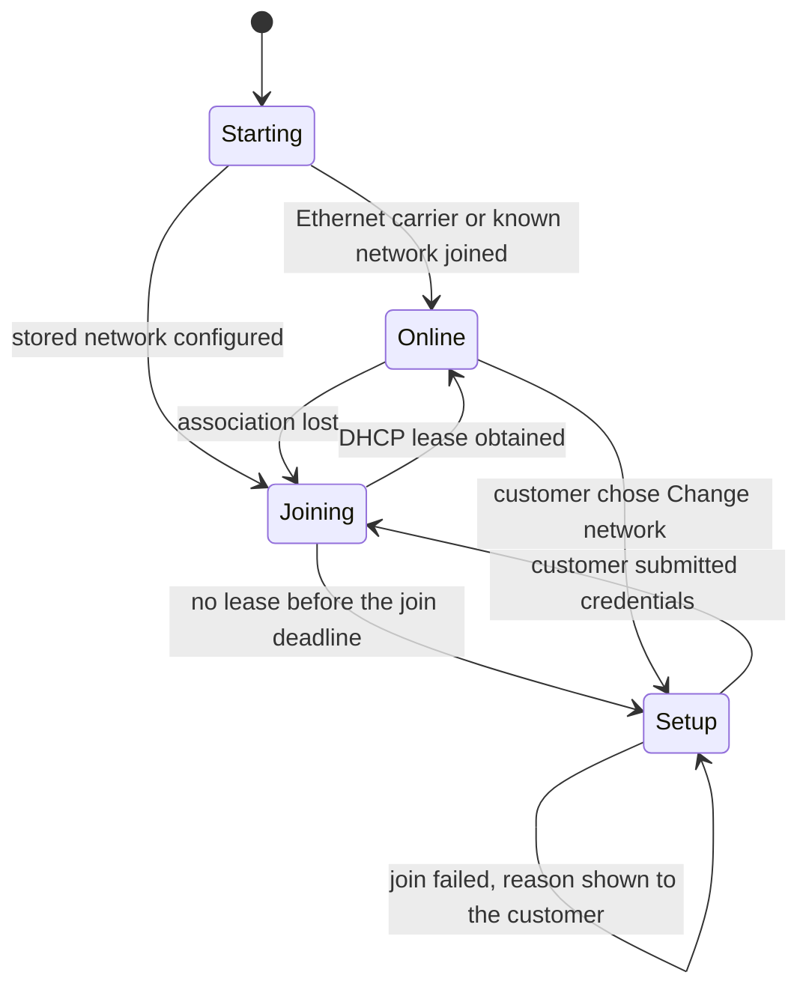

# Hub Wi-Fi onboarding

## Status

Proposed. No implementation exists. This document also introduces the Raspberry Pi
hub appliance as a packaging target; no other repository document currently names
a specific hub host.

## Purpose

Define how a household customer gets a headless Open Plant Pulse hub onto their
home Wi-Fi, and how they recover when that network changes. The hub is the only
product component that needs a network. Sensor nodes stay BLE-only: the sensor
design deliberately rejects Wi-Fi for battery life, and nothing in this proposal
changes the bounded BTHome advertise/deep-sleep lifecycle.

Today the hub is a Python service started from a terminal with `--host` defaulting
to `127.0.0.1`. That is correct for development and unusable as an appliance. A
customer who plugs in a Pi with no screen, no keyboard, and no known network
currently has no way to reach it at all.

## Scope

In scope: the hub appliance's first network join, later network changes, recovery
from a wrong or stale password, and how the customer finds the hub afterwards.

Out of scope: hub authentication and multi-user access, remote/off-LAN access,
sensor Wi-Fi of any kind, and Ethernet-only deployments beyond detecting them and
skipping onboarding.

## Goals

- A customer with only a phone can bring a new hub onto their Wi-Fi.
- Onboarding never requires a terminal, SSH, a serial cable, or a second computer
  once the storage medium is written.
- A wrong password is reported as a wrong password, not as silence.
- Changing router, SSID, or password is a supported customer action, not a
  reinstall.
- The customer knows the hub's address when onboarding finishes.
- The home Wi-Fi password is never written to a log, a database, or a repository
  file, and never leaves the appliance.

## Non-goals

- A mobile application. Everything runs in a browser.
- Enterprise, captive-portal, or 802.1X guest networks.
- Simultaneous access-point and station operation.
- Onboarding over the sensor BLE service. The hub owns the radio for BTHome
  scanning, and a second provisioning role on the same adapter adds risk for no
  customer benefit.

## Customer experience

### First power-on, pre-configured path

1. The customer writes the hub image to an SD card with Raspberry Pi Imager and
   enters their Wi-Fi name and password in the Imager's own settings dialog.
2. They insert the card and power the Pi.
3. The hub joins Wi-Fi, starts collecting, and is reachable at
   `http://plantpulse.local/`.
4. The first page they see is the sensor inbox, already listing any sensor in
   range.

No new code is required for step 1; Raspberry Pi Imager already performs this.
The work is in steps 3 and 4.

### First power-on, unconfigured path

Used when the appliance was pre-imaged, the customer skipped the Imager dialog, or
the stored network is gone.

1. The hub finds no known network and raises its own Wi-Fi hotspot named
   `PlantPulse setup`.
2. The customer joins it from a phone, entering the setup password printed on the
   appliance label.
3. Their phone detects the captive portal and opens the setup page by itself. If
   it does not, `http://10.42.0.1/` reaches the same page.
4. The page lists nearby networks by signal strength. They pick theirs and type
   the password.
5. The page reports progress, then confirms success and shows the address the hub
   will have on the home network.
6. The hotspot shuts down and the hub joins the chosen network.

### Changing network later

The same setup page is reachable from the hub's normal web UI under settings while
the hub is online. If the hub ever fails to rejoin for longer than a set interval,
it raises the setup hotspot again on its own. A customer who moves house can power
the hub up in the new place and onboard it exactly as they did the first time.

## Options considered

| Option | Customer cost | Build cost | Verdict |
| --- | --- | --- | --- |
| Raspberry Pi Imager pre-configuration | Types Wi-Fi once while flashing | None | Adopt as the primary path |
| Hub-owned setup hotspot and portal | Joins a hotspot, picks a network | Moderate | Adopt as the recovery path |
| `balena wifi-connect` | Same as above | Low, but adds a Rust binary and a foreign UI | Fallback if we decline to own the portal |
| `comitup` | Same as above | Low, but opinionated about the whole network stack | Rejected |
| Edit a file on the boot partition | Needs a computer and file-editing confidence | Low | Rejected as a customer path; keep as a support tool |
| Ship pre-configured per customer | None at first, total failure on any change | Low | Rejected |

Two conclusions drive the recommendation. First, the customer is already flashing
storage, and the official Imager already collects Wi-Fi credentials at that moment,
so the common case needs no portal. Second, a portal is still required, because
pre-configuration cannot survive a router change and cannot help a pre-imaged
appliance.

`balena wifi-connect` is a reasonable escape hatch. It is rejected as the default
because its portal is a separate interface with its own look and no knowledge of
the hub, and because the hub already runs a `ThreadingHTTPServer` that can serve
the setup page in the product's own design. `docs/hub.md` directs implementations
to extend the existing standard-library server before adding dependencies, and a
portal driven by `nmcli` honours that.

## Recommended design

A two-tier design. Pre-configuration handles the common case. A hub-owned setup
hotspot handles every case pre-configuration cannot.

### Network state machine

Only one state owns the radio at a time. The Pi has a single Wi-Fi interface, and
concurrent access-point and station operation on it is not dependable, so `Setup`
and `Joining` never overlap.

### Components

A new `hub/src/open_plant_pulse_hub/network/` package holding:

- `manager.py`, the state machine above, owning every transition.
- `nmcli.py`, a thin typed wrapper over NetworkManager. Scan, list saved
  connections, join, forget, raise hotspot, tear down hotspot. Every call is a
  bounded subprocess invocation with an explicit timeout and a parsed exit status.
  This is the only module that shells out.
- `portal.py`, the setup request handlers, mounted on the existing HTTP server
  rather than a second server.

`nmcli` is chosen over talking to NetworkManager's D-Bus API directly because it is
stable across releases, trivially testable by substituting a fake binary, and
readable in logs. The wrapper keeps the subprocess surface in one file so a later
move to D-Bus touches nothing else.

### Setup endpoints

Served only while the appliance is in `Setup`, or from the authenticated settings
area once the hub is online.

| Method and path | Purpose |
| --- | --- |
| `GET /setup` | The setup page |
| `GET /setup/networks` | Scan results: SSID, signal, security, whether a password is needed |
| `POST /setup/connect` | Submit SSID and password; returns a job identifier |
| `GET /setup/status` | Join progress and the precise failure reason |
| `POST /setup/forget` | Remove a stored network |

`GET /generate_204`, `GET /hotspot-detect.html`, and the other vendor probe paths
redirect to `/setup` so phones open the page by themselves. NetworkManager's shared
mode already runs a DHCP and DNS service on `10.42.0.1`; the portal additionally
needs wildcard DNS pointed at that address for detection to work on every handset.

### Reporting failures honestly

The join result must distinguish, at minimum: wrong password, SSID not found,
association timeout, DHCP timeout, and 5 GHz-only network on a band the adapter did
not join. Each maps to a sentence the customer can act on. This is the single
largest experience difference from the current firmware behaviour, where every
failure looks identical, and it is a hard requirement rather than polish.

## Security

The customer types their home Wi-Fi password into this page, so the setup path is
the most sensitive surface in the product.

- The setup hotspot uses WPA2 with a per-appliance password derived at first boot
  and printed on the appliance label and by the installer. An open hotspot would
  expose the home password to anyone in range for the duration of the window, and
  a self-signed certificate cannot be used instead because it breaks captive-portal
  detection on major handsets.
- The hotspot runs only while the appliance is in `Setup`, and closes on success.
- Credentials pass to NetworkManager and are stored by it. The hub never writes
  them to its own database, configuration, or logs. Existing repository rules
  already forbid logging Wi-Fi passwords; this design must not create an exception.
- `GET /setup/networks` returns SSIDs and signal levels only, never a stored
  password, and `/setup/status` never echoes a submitted one.
- While online, the setup endpoints are reachable only from the hub's normal web
  UI and are subject to its existing same-origin checks.
- The hub has no user authentication today. Once the appliance binds the LAN,
  anyone on the household network can reach it and, with these endpoints, move it
  to another network. That is a real gap. It is out of scope here, but the
  appliance should not be called finished until it is addressed, and this document
  should be revisited then.

## Radio coexistence

The Pi's Wi-Fi and Bluetooth share a combo radio. BTHome scanning is the hub's
primary job, and an active access point measurably degrades reception on the same
chip. During `Setup` the appliance has no enrolled sensors in the normal case, so
BLE scanning pauses while the hotspot is up and resumes when it closes. When a
customer opens setup deliberately on an already-enrolled hub, the UI must state
that collection pauses. Whether the degradation is tolerable enough to keep
scanning instead is a measurement, not a guess, and is listed under validation.

## Finding the hub afterwards

Onboarding is not finished when the hub has an address; it is finished when the
customer can reach it. This requires changes beyond the network package:

- Publish `plantpulse.local` over mDNS with Avahi, so no one needs to read a
  router's client list.
- Bind the LAN rather than loopback when running as an appliance. The `--host`
  default stays `127.0.0.1` for development; the packaged service passes an
  explicit bind address, and `deploy/` documents the firewall expectation.
- Show the hub's address and hostname on the setup success page and in the web UI
  footer, because mDNS fails on some networks and the customer needs the fallback.

## Delivery plan

### Phase 1: Reachable appliance

- [ ] Document the Raspberry Pi appliance target, supported models, and the
      Imager-based first install.
- [ ] Add mDNS publication and an appliance bind address, keeping the development
      default on loopback.
- [ ] Package the hub as a service that starts on boot, extending `deploy/`.
- [ ] Show address and hostname in the web UI.

This phase alone makes the pre-configured path work end to end and carries no
portal risk.

### Phase 2: NetworkManager wrapper

- [ ] Add `nmcli.py` with bounded, timed subprocess calls and parsed results.
- [ ] Add the state machine with no portal attached, driven by stored networks.
- [ ] Host-test both against a fake `nmcli` covering success, wrong password, SSID
      absent, association timeout, and DHCP timeout.

### Phase 3: Setup portal

- [ ] Add the setup endpoints and page, reusing the existing server and frontend
      conventions.
- [ ] Add hotspot raise and teardown, with the per-appliance password.
- [ ] Add captive-portal probe redirects and wildcard DNS.
- [ ] Add the automatic return to `Setup` after a sustained join failure.

### Phase 4: Change and recovery

- [ ] Add the settings entry point for changing network while online.
- [ ] Add forget-network and a documented physical recovery action.
- [ ] Document the move-house and new-router procedures for customers.

## Validation strategy

Following the repository rule that code completion, build success, and hardware
validation are separate claims, none of the following may be inferred from the
others:

- [ ] Host tests pass against the fake `nmcli` for every failure classification.
- [ ] On real hardware, a hub with no stored network raises the hotspot within a
      stated time of boot.
- [ ] An iPhone and an Android handset each open the portal automatically.
- [ ] A correct password joins, and the hotspot closes.
- [ ] A wrong password produces the wrong-password message, not a timeout, and the
      hotspot stays available.
- [ ] Powering the hub where the stored network is absent returns it to `Setup`
      without manual intervention.
- [ ] `plantpulse.local` resolves from macOS, iOS, Android, and Windows clients.
- [ ] BTHome reception is measured with the hotspot up and with it down, and the
      difference is recorded rather than assumed.
- [ ] The home Wi-Fi password appears in no log, database, or captured output.

## Open questions

- Which Raspberry Pi models are supported, and is a Pi Zero 2 W in scope? The
  answer changes the radio-coexistence budget.
- Is the appliance sold or self-built? A self-built hub can be told its setup
  password by the installer script; a sold one needs a physical label produced at
  packaging time.
- Should a wired Ethernet carrier suppress the setup hotspot permanently, or should
  the customer still be able to add Wi-Fi as a fallback link?
- Does hub authentication land before or after this work? If after, the appliance
  ships with an unauthenticated network-change endpoint on the LAN.
