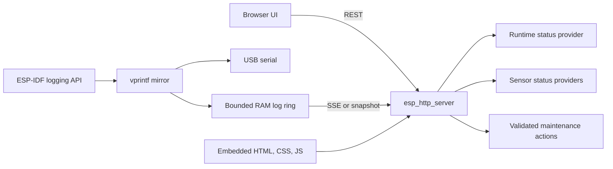

# Sensor web UI redesign

## Status

Proposed development-only diagnostics interface for the ESP32-C3 sensor node.

## Purpose

Replace the current embedded single-page log viewer with a maintainable device
console while retaining ESP-IDF's Apache-2.0 `esp_http_server`. The console is
for bench development, bring-up, and fault diagnosis. It is not the product's
historical dashboard; long-term readings, analytics, plant care, and Home
Assistant integration remain responsibilities of the hub.

The production sensor remains BLE-first and battery-oriented. Wi-Fi and this UI
must stay optional and be disabled for power measurements and deployed
low-power builds.

## Goals

- Present device, network, sensor, and runtime health at a glance.
- Stream and inspect ESP-IDF logs without requiring a USB serial connection.
- Provide safe diagnostic actions such as log clearing and device restart.
- Support SHT45 and RS-485 bring-up as those drivers are implemented.
- Keep frontend assets independent from C request-handling code.
- Use only open-source ESP-IDF facilities and dependency-free browser code.
- Fit comfortably within ESP32-C3 flash, RAM, and request-stack constraints.

## Non-goals

- Replacing the hub dashboard or storing historical measurements on the sensor.
- Running Wi-Fi continuously in the final battery lifecycle.
- Exposing credentials, secrets, arbitrary memory, or an unrestricted command
  shell.
- Adding cloud services, accounts, or internet dependencies.
- Implementing sensor controls before the underlying drivers and safety rules
  exist.

## User experience

The interface should feel like a compact instrument panel rather than a
marketing page. It should load quickly on desktop and mobile, remain useful on a
narrow phone screen, and make connection or sensor failures obvious without
requiring interpretation of raw logs.

### Navigation

Use four top-level views:

1. **Overview**: connection, firmware, runtime, memory, and current sensor state.
2. **Sensors**: SHT45 and soil-probe readings, health, last sample, and errors.
3. **Logs**: live console with search, level filters, pause, auto-scroll, clear,
   and download.
4. **Maintenance**: configuration, restart, and later firmware update.

Do not render empty decorative cards. A section that has no implemented data
should show one compact unavailable state and identify the missing subsystem.

### Visual direction

- Quiet technical palette with neutral surfaces, green reserved for healthy
  state, amber for degraded state, and red for failures.
- Dense, readable typography suitable for repeated diagnostic use.
- Monospace only for addresses, identifiers, measurements, and logs.
- Stable responsive dimensions so status changes do not shift controls.
- Familiar icons for search, pause, download, clear, restart, and update, each
  with an accessible label or tooltip.
- No external fonts, scripts, analytics, CDNs, or network requests.

## Proposed architecture



Keep the existing `esp_log_set_vprintf` mirror and bounded ring buffer. Split
network lifecycle, HTTP routing, log storage, and frontend assets as complexity
grows rather than leaving every concern in one source file.

### Proposed file layout

```text
sensor/firmware/main/
├── app_main.c
├── web_ui.c
├── web_ui.h
├── web_ui_api.c
├── web_ui_api.h
└── web/
    ├── index.html
    ├── app.css
    └── app.js
```

Embed the three frontend files with ESP-IDF CMake and serve them with explicit
content types and cache policy. During development they can remain uncompressed;
gzip embedding should be considered only after measuring image size and load
time.

## HTTP interface

Version device APIs from the beginning so frontend changes do not silently
break firmware contracts.

| Method | Route | Purpose |
| --- | --- | --- |
| `GET` | `/` | Application shell |
| `GET` | `/app.css` | Embedded stylesheet |
| `GET` | `/app.js` | Embedded browser logic |
| `GET` | `/favicon.ico` | Embedded icon or `204 No Content` |
| `GET` | `/api/v1/status` | Runtime, firmware, network, and memory state |
| `GET` | `/api/v1/logs` | Plain-text bounded log snapshot |
| `GET` | `/api/v1/events` | Server-Sent Events for live logs and status |
| `POST` | `/api/v1/logs/clear` | Clear the in-memory log ring |
| `GET` | `/api/v1/sensors` | Current sensor values and health |
| `GET` | `/api/v1/config` | Non-secret editable configuration |
| `PUT` | `/api/v1/config` | Validate and persist allowed configuration |
| `POST` | `/api/v1/restart` | Schedule a controlled restart |
| `POST` | `/api/v1/ota` | Later authenticated OTA upload |

Keep compatibility aliases for `/logs` and `/status` during the first migration,
then remove them after the new frontend and documentation use versioned routes.

### Status response

The status endpoint should eventually include:

- Connection state, IPv4 address, station MAC, RSSI, channel, and SSID.
- Uptime, reset reason, ESP-IDF version, application version, and build time.
- Free heap, minimum free heap, largest free block, and flash size.
- Web UI mode and whether the build is development or production.

Never include the Wi-Fi password or other secrets.

### Sensor response

Each sensor should report independently:

- State: `unavailable`, `initializing`, `healthy`, or `error`.
- Current measurements with explicit units.
- Last successful sample age.
- Last error code and a short bounded message.
- Bus metadata useful during bring-up, such as I2C address or Modbus address.

An unavailable sensor must not return stale values as current readings.

## Live updates

Start with the existing one-second polling while the asset split and status API
are stabilized. Then add Server-Sent Events at `/api/v1/events` for log lines,
connection changes, and sensor updates.

SSE is preferred over WebSockets because current traffic is primarily
server-to-browser, browser support is built in, reconnection is automatic, and
the protocol is easier to bound. Keep snapshot endpoints for initial page load
and troubleshooting.

The SSE implementation must:

- Limit the number of simultaneous clients.
- Drop or disconnect slow clients rather than blocking logging tasks.
- Never send network data directly from `web_ui_vprintf`.
- Queue only bounded event data for an HTTP worker or dedicated low-priority
  task.
- Preserve serial logging if no browser is connected.

## Controls and safety

### Initial controls

- Pause/resume rendering without stopping capture.
- Toggle auto-scroll.
- Filter logs by text and `E`, `W`, `I`, `D`, or `V` level.
- Clear the device log ring after confirmation.
- Download the current log snapshot in the browser.
- Restart the device after explicit confirmation.

### Later controls

- Trigger one bounded SHT45 sample.
- Trigger one bounded soil-probe transaction.
- Run an I2C scan with a clear warning that it is diagnostic behavior.
- Edit sample interval and verified bus settings.
- Upload an OTA image with validation and progress reporting.

Actions must call narrow firmware APIs. The UI must not provide arbitrary GPIO,
register-write, shell, or memory-access endpoints.

## Configuration and security

The present UI is plain HTTP on a trusted local network. Before adding mutation
or OTA endpoints:

- Add a development-only authentication mechanism or require a short-lived
  physical-presence window opened by a button/reset sequence.
- Apply request-body and field-length limits before parsing.
- Reject unknown fields and out-of-range values.
- Add CSRF protection for state-changing requests if browser credentials are
  introduced.
- Delay restart until its HTTP response has been sent.
- Validate OTA image target, size, signature policy, and partition capacity.
- Do not expose Wi-Fi credentials through any read endpoint or logs.

The generated `sensor/sdkconfig` remains ignored and local. Portable defaults
must not contain private network credentials.

## Resource budgets

Initial budgets should be treated as acceptance constraints and adjusted only
from measurements:

- Frontend assets: target below 100 KiB total before compression.
- Log ring: retain the current 16 KiB fixed bound.
- HTTP response generation: avoid allocating more than one log snapshot.
- API JSON: use bounded stack buffers for small responses and checked lengths.
- SSE clients: maximum two concurrent clients initially.
- No unbounded queues, strings, request bodies, or retained browser sessions.

Report free heap and minimum-ever free heap in the status API so regressions are
visible during soak testing.

## Delivery plan

### Phase 1: Asset separation and shell

- [x] Move HTML, CSS, and JavaScript out of `web_ui.c`.
- [x] Embed and serve each asset from the firmware image.
- [x] Add responsive navigation and Overview, Sensors, Logs, and Maintenance views.
- [x] Add a favicon route to remove the current expected 404 noise.
- [x] Preserve existing `/logs` and `/status` behavior.

**Exit:** the redesigned shell loads without external resources on desktop and
mobile, and existing log capture still works.

Completed 2026-09-12. The uncompressed assets total 15,374 bytes. The firmware
was built and flashed to the bench ESP32-C3, all six HTTP routes returned their
expected status, and the interface was checked at desktop and 390 px mobile
widths without horizontal page overflow.

### Phase 2: Versioned status and log tools

- Add `/api/v1/status` with firmware, reset, Wi-Fi, heap, and flash fields.
- Add `/api/v1/logs` and `/api/v1/logs/clear`.
- Implement browser search, level filtering, pause, auto-scroll, clear, and
  download.
- Add endpoint and JSON contract tests where host-testable.

**Exit:** the page supports routine diagnosis without USB and all buffers remain
bounded under repeated refresh and clear operations.

### Phase 3: Live event stream

- Add bounded SSE delivery for logs and status changes.
- Keep snapshot loading and polling as a fallback.
- Exercise disconnect, reconnect, slow-client, and two-client behavior.

**Exit:** new logs appear without polling, Wi-Fi reconnect does not stop serial
logging, and a slow browser cannot stall firmware tasks.

### Phase 4: Sensor integration

- Define a small read-only status interface owned by each sensor driver.
- Show SHT45 and soil-probe values, timestamps, and independent failures.
- Add bounded one-shot diagnostic reads only after normal drivers are proven.

**Exit:** displayed values match serial output and reference measurements, and
failed reads never appear as fresh data.

### Phase 5: Maintenance

- Add validated non-secret configuration writes to NVS.
- [x] Add controlled restart with confirmation.
- Design authentication and physical-presence policy.
- Add OTA only after partition layout, rollback, and image validation are
  specified and tested.

**Exit:** interrupted or invalid maintenance operations leave the device
bootable with previous valid configuration or firmware.

## Validation strategy

For every phase:

1. Run `sensor/firmware/build.sh` with web UI enabled and disabled.
2. Flash through `sensor/firmware/flush.sh` and verify serial remains available.
3. Exercise every endpoint with `curl`, including malformed requests.
4. Verify the page at desktop and mobile widths with browser screenshots.
5. Observe heap before loading, during repeated refresh, and after disconnect.
6. Reconnect Wi-Fi and confirm the server and event stream recover.
7. Confirm no password or secret appears in responses, logs, binaries checked
   into source control, or tracked configuration.
8. Disable the UI and verify the intended BLE/deep-sleep build remains possible.

## First implementation milestone

Implement Phases 1 and 2 before adding SSE. This creates the maintainable asset
boundary and useful controls while retaining the already proven polling and log
capture path. It also establishes stable APIs that the later event stream and
sensor drivers can reuse.
