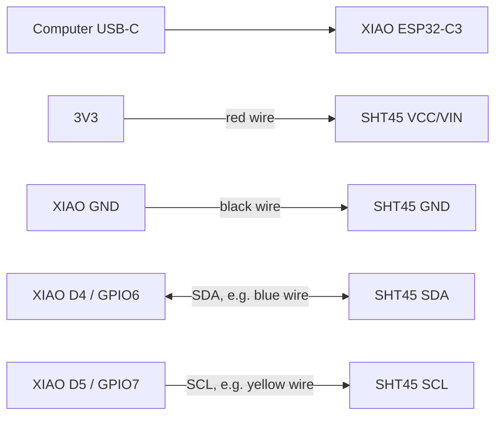
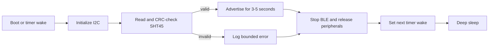

# XIAO ESP32-C3 and SHT45 first sensor node

This guide builds the first physical Open Plant Pulse data path:

```text
SHT45 -> I2C -> XIAO ESP32-C3 -> BTHome v2 over BLE -> hub computer
```

The first milestone measures only ambient air temperature and relative humidity.
It deliberately leaves the RS485 soil probe, battery, deep sleep, and final
enclosure out of the circuit until the basic path is reliable.

> [!IMPORTANT]
> Record the exact SHT45 breakout manufacturer and product revision before
> wiring it. The SHT45 IC accepts 1.08-3.6 V, but a breakout may add a regulator,
> level shifter, pull-ups, or a power LED. Follow the breakout's printed pin
> labels and datasheet when they differ from this guide. Never apply 5 V to an
> unverified SHT45 board or directly to an ESP32-C3 GPIO.

## Goal and acceptance criteria

Complete the work in four checkpoints. Do not move to the next checkpoint until
the current one is repeatable.

1. The XIAO boots from USB and is recoverable with its BOOT and RESET buttons.
2. The I2C controller finds one device at address `0x44`.
3. Ten consecutive CRC-checked SHT45 readings are plausible and stable in the
   serial monitor.
4. The hub computer receives and decodes the same readings from BLE without
   requiring the sensor to join Wi-Fi.

For the first bench test, keep the XIAO connected to USB and sample every five
seconds. Add deep sleep only after all four checkpoints pass.

## Hardware wiring

### Parts and tools

- Seeed Studio XIAO ESP32-C3 and its external BLE antenna.
- An SHT45 breakout with accessible `VCC` or `VIN`, `GND`, `SDA`, and `SCL` pins.
- A data-capable USB-C cable.
- Four short jumper wires and, if needed, soldered 2.54 mm headers.
- A multimeter.
- Optional but useful: a breadboard and logic analyzer.

Do not connect a Li-ion battery during this bring-up. Do not connect the RS485
board or soil probe yet.

### Identify the SHT45 breakout first

Before applying power, photograph both sides of the board and record:

- Manufacturer, product name, and revision.
- Whether the power pin is labeled `VCC`, `VIN`, or `3V3`.
- Whether the board claims 3.3 V only or includes a wider-input regulator.
- Whether SDA and SCL pull-up resistors are fitted. They are often marked `472`
  for 4.7 kohm or `103` for 10 kohm, but confirm against the board schematic.
- Whether the board includes an always-on LED, which matters later for battery
  life and self-heating.

A bare SHT45 is a tiny DFN package and cannot be connected with jumper wires. If
your board has header pads, support components, and pin labels, it is a breakout.

### Pin mapping

Use the XIAO pin names printed on the board as the primary reference.

| SHT45 breakout | XIAO ESP32-C3 | ESP32-C3 signal | Purpose |
| --- | --- | --- | --- |
| `VCC`, `VIN`, or `3V3` | `3V3` | 3.3 V regulated output | Sensor power |
| `GND` | `GND` | Ground | Common reference |
| `SDA` | `D4` | GPIO6 | I2C data |
| `SCL` | `D5` | GPIO7 | I2C clock |



The diagram's wire colors are suggestions, not electrical requirements. The
I2C lines are bidirectional open-drain signals even though the SCL arrow is
shown in its usual controller-to-sensor direction.

### Pull-ups and bus layout

I2C requires SDA and SCL pull-ups to 3.3 V. Most SHT45 breakouts already include
them. Use one effective set of external pull-ups, typically 2.2-10 kohm; about
4.7 kohm is a reasonable starting point for short bench wires at 100 kHz.

- Do not add another pair until the breakout schematic or measurement confirms
  that pull-ups are absent.
- With power disconnected, measure resistance from SDA to the breakout power pin
  and from SCL to the breakout power pin. A steady value near the marked resistor
  value indicates fitted pull-ups. Other circuitry can affect this measurement.
- Keep each I2C wire below about 20 cm for initial testing.
- Use 100 kHz for bring-up. The ESP32-C3 supports up to 400 kHz, but speed is not
  useful until wiring and signal integrity are proven.

The ESP32-C3's internal pull-ups are useful for diagnosis but are not a robust
substitute for correctly sized external pull-ups.

### Pre-power inspection

With USB disconnected:

1. Check that `3V3` is not shorted to `GND`.
2. Check that SDA is connected only to D4/GPIO6 and SCL only to D5/GPIO7.
3. Confirm that no wire is connected to the XIAO `5V` pin.
4. Attach the external antenna before sustained BLE testing. Press the tiny U.FL
   connector straight down; do not lever it sideways.
5. Position the SHT45 away from the XIAO regulator, ESP32-C3, direct sunlight,
   your breath, and your fingers.

After connecting USB, measure approximately 3.3 V between the SHT45 power and
ground pins. Disconnect immediately if the board becomes hot or the voltage is
wrong.

### Placement after bench testing

The SHT45 should measure ambient air, not enclosure temperature. In the final
assembly:

- Put its sensing opening in ventilated air outside the warm electronics cavity.
- Keep it away from the ESP32-C3, voltage converters, battery, and direct sun.
- Do not cover the sensing opening with conformal coating, adhesive, or tape.
- Protect it from soil, splashes, and condensation without sealing off airflow.
- Compare it with a trusted reference only after both have settled in the same
  location for at least 15-30 minutes.

## Software writing

### 1. Prepare ESP-IDF and verify the board

Use ESP-IDF 5.2 or newer. In an ESP-IDF-enabled terminal:

```sh
cd sensor
idf.py set-target esp32c3
idf.py build
idf.py -p /dev/cu.usbmodemXXXX flash monitor
```

Replace the serial device with the result of:

```sh
ls /dev/cu.*
```

The existing scaffold should log `Open Plant Pulse firmware starting`. Exit the
monitor with `Ctrl-]`. If flashing fails, hold BOOT, tap RESET, release BOOT, and
retry. Confirm the exact recovery sequence against the XIAO board revision.

### 2. Add a dedicated SHT45 component

Keep sensor communication out of `app_main.c`. Add this component layout:

```text
sensor/firmware/components/sht45/
├── CMakeLists.txt
├── include/
│   └── sht45.h
└── sht45.c
```

The public API should return values only after both CRC bytes pass:

```c
typedef struct {
    float air_temperature_c;
    float air_humidity_percent;
} opp_sht45_sample_t;

esp_err_t opp_sht45_init(void);
esp_err_t opp_sht45_probe(void);
esp_err_t opp_sht45_read(opp_sht45_sample_t *sample);
```

Add `esp_driver_i2c` to the component's `REQUIRES` list. Configure one I2C master
bus with:

| Setting | Value |
| --- | --- |
| Port | `I2C_NUM_0` |
| SDA | GPIO6 |
| SCL | GPIO7 |
| Clock | 100000 Hz |
| Address | 7-bit `0x44`, not shifted |
| Transaction timeout | 100 ms |

Use ESP-IDF's `driver/i2c_master.h` bus-device API:

1. Call `i2c_new_master_bus()`.
2. Call `i2c_master_probe(bus, 0x44, 100)` and fail clearly if it does not ACK.
3. Add address `0x44` with `i2c_master_bus_add_device()`.
4. Reuse the handles for each sample; do not repeatedly install the driver.

### 3. Implement one CRC-checked measurement

Use the SHT4x high-precision, no-heater command `0xFD` for initial work:

1. Send the one-byte command with `i2c_master_transmit()`.
2. Wait at least the maximum conversion time specified by the current SHT4x
   datasheet; 10 ms is a practical initial delay for the nominal 8.3 ms command.
3. Read exactly six bytes with `i2c_master_receive()`.
4. Interpret the bytes as `temp_msb temp_lsb temp_crc rh_msb rh_lsb rh_crc`.
5. Validate each two-byte word with its following CRC before conversion.

SHT4x CRC-8 uses initial value `0xFF`, polynomial `0x31`, and no final XOR:

```c
static uint8_t sht4x_crc(const uint8_t *data, size_t length)
{
    uint8_t crc = 0xff;

    for (size_t index = 0; index < length; ++index) {
        crc ^= data[index];
        for (int bit = 0; bit < 8; ++bit) {
            crc = (crc & 0x80) ? (uint8_t)((crc << 1) ^ 0x31)
                               : (uint8_t)(crc << 1);
        }
    }
    return crc;
}
```

After CRC validation, combine each word as unsigned big-endian and convert:

$$
T_{\degree C} = -45 + 175 \times \frac{S_T}{65535}
$$

$$
RH_{\%} = -6 + 125 \times \frac{S_{RH}}{65535}
$$

Clamp relative humidity to 0-100% after conversion. Reject a transaction on a
NACK, timeout, short read, or either CRC mismatch. Do not reuse a previous sample
after a failure.

For the first firmware loop, read every five seconds and log:

```text
SHT45 air_temperature_c=23.42 air_humidity_percent=51.87
```

Touching or breathing on the sensor should cause an obvious response. Then leave
it untouched and verify ten consecutive valid samples.

### 4. Add host tests before BLE

Keep conversion and CRC logic independent of ESP-IDF so it can be tested by the
host C compiler. Add tests for:

- The CRC example bytes from the current Sensirion datasheet.
- A known raw temperature/humidity response and expected converted values.
- A corrupted temperature CRC.
- A corrupted humidity CRC.
- Humidity clamping below 0% and above 100%.
- Null output pointers and short responses.

Extend `scripts/test-sensor.sh` to compile the pure parsing source. Run:

```sh
sh scripts/test-sensor.sh
```

Only the thin I2C transport should depend on ESP-IDF; the response parser should
remain host-testable.

### 5. Define the air-only bring-up advertisement

The repository's released BTHome contract v1 is soil-only. Do not silently call
an air-only packet contract v1. For this bring-up, use a temporary documented
payload under service UUID `0xFCD2`:

| Byte(s) | Meaning | Encoding |
| --- | --- | --- |
| 0 | BTHome device information | `0x40`: v2, unencrypted, regular interval |
| 1 | Temperature object | `0x02` |
| 2-3 | Air temperature | signed little-endian, factor 0.01 degrees C |
| 4 | Humidity object | `0x03` |
| 5-6 | Relative humidity | unsigned little-endian, factor 0.01% |

For 23.42 degrees C and 51.87% RH, the service data is:

```text
40 02 26 09 03 43 14
```

Use a local name such as `OPP-AIR-A1B2`, where the suffix comes from the final
two bytes of the factory MAC. This is adequate for bench identification, but it
is not the project's final cross-platform enrollment design.

Encode with rounded, range-checked integers:

```c
int16_t temperature = (int16_t)lroundf(sample.air_temperature_c * 100.0f);
uint16_t humidity = (uint16_t)lroundf(sample.air_humidity_percent * 100.0f);
```

Initialize NimBLE, advertise the local name and `0xFCD2` service data for a
bounded window such as 3-5 seconds, then stop advertising. During initial USB
testing, repeat the measure-and-advertise cycle every five seconds without deep
sleep so logs remain available.

### 6. Add the hub's air-only BLE ingestion path

The current hub does **not** yet accept this physical packet:

- `ingestion/bthome.py` requires the soil-only 10-byte v1 payload.
- `SensorReading` and SQLite rows require soil temperature, moisture, and
  conductivity.
- `SimulationUdpReceiver` is intentionally loopback-only and requires a full
  simulated soil-and-air reading. Do not expose it to the LAN or fill missing
  soil values with fake zeros.

Implement the server side in this order:

1. Add an air-only BTHome decoder for the exact seven-byte payload above. Test a
   valid fixture, signed negative temperature, wrong object order, wrong length,
   unsupported device-info flags, and truncated data.
2. Add a Bleak scanner adapter that filters service UUID `0000fcd2-0000-1000-8000-00805f9b34fb`
   and local names beginning with `OPP-AIR-`.
3. Give the adapter an explicit start/stop lifecycle and isolate malformed
   advertisements so one bad device cannot stop scanning.
4. Introduce an air-sample domain/storage path with nullable soil fields or a
   separate typed `AirReading`. Preserve the distinction between absent data and
   a measured zero. A separate type is preferable while care-event logic still
   assumes soil readings.
5. Assign `observed_at` from the hub's UTC receipt time because the advertisement
   contains no wall clock. Add a packet ID before relying on deduplication across
   repeated advertisements.
6. Feed accepted samples into SQLite and expose them through the existing latest
   and history APIs. Keep care-event detection disabled for air-only samples.

On macOS, grant Bluetooth permission to the terminal or Python executable that
runs the hub. On Linux, verify that BlueZ is running and that the service account
has permission to scan. Run the hub's HTTP API on loopback unless LAN access is
explicitly secured.

Before integrating persistence, a short diagnostic Bleak script may print the
decoded values. That still counts as checkpoint 4 only when readings are stable
for at least ten minutes and malformed packets are rejected without terminating
the scanner.

### 7. Verify end to end

Run the hub and open its dashboard:

```sh
PYTHONPATH=hub/src python3 -m open_plant_pulse_hub
```

The physical-node acceptance test is:

1. The serial log reports address `0x44` and valid CRCs.
2. A BLE scanner sees `OPP-AIR-xxxx` and UUID `0xFCD2`.
3. Decoded BLE values match the serial values within rounding error.
4. The hub API returns non-null `air_temperature_c` and
   `air_humidity_percent` with a UTC receipt time.
5. The dashboard updates both air measurements without displaying fabricated
   soil measurements.
6. Disconnecting the SHT45 produces a bounded error and no stale advertisement.
7. Restarting the hub resumes scanning and does not crash on repeated packets.

Run all repository checks after each completed layer:

```sh
sh scripts/check.sh
```

### 8. Add deep sleep last

After USB and BLE tests pass, change the lifecycle to:



Start with a one-minute interval for bench observation, then restore the project
default after validation. Never enter deep sleep while the BLE stack is still
advertising. A failed SHT45 read should produce no measurement advertisement.

## Troubleshooting

| Symptom | Likely cause | Check |
| --- | --- | --- |
| No serial device | Charge-only cable or boot mode | Use a data cable; try BOOT plus RESET |
| I2C address `0x44` not found | SDA/SCL swapped, no power, missing pull-ups | Check voltage, labels, continuity, and pull-ups |
| I2C timeout | Bus held low or poor pull-ups | Measure idle SDA/SCL near 3.3 V; shorten wires |
| CRC failures | Wiring noise, early read, wrong byte order | Use 100 kHz, wait 10 ms, inspect all six bytes |
| Temperature reads too high | Board heat or poor placement | Move the SHT45 away from the XIAO and wait to settle |
| Humidity jumps while testing | Breath or handling | Stop touching it and allow several minutes to recover |
| BLE visible but hub gets nothing | Hub decoder still expects soil v1 | Implement the air-only decoder and Bleak adapter |
| BLE disappears during sleep | Expected behavior | Scan across the complete wake interval |

## References

- [Seeed XIAO ESP32-C3 getting started and pin map](https://wiki.seeedstudio.com/XIAO_ESP32C3_Getting_Started/)
- [Sensirion SHT45 product page and current datasheet](https://sensirion.com/products/catalog/SHT45)
- [ESP-IDF ESP32-C3 I2C master documentation](https://docs.espressif.com/projects/esp-idf/en/stable/esp32c3/api-reference/peripherals/i2c.html)
- [BTHome v2 format](https://bthome.io/format/)
- [Bleak documentation](https://bleak.readthedocs.io/)
- [Open Plant Pulse protocol](../protocol/README.md)
- [Open Plant Pulse power lifecycle](power-management.md)
